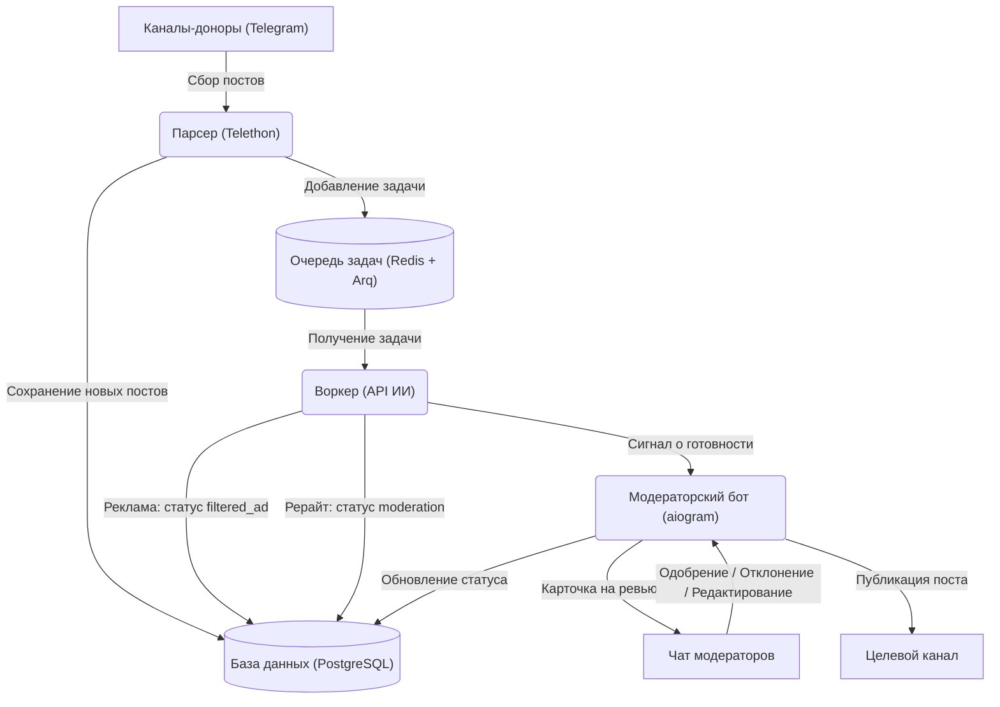

*English version is available in [README_en.md](README_en.md)*

# Telegram Channel Admin (AI Moderator)

[](https://www.python.org)
[](https://www.docker.com)
[](https://github.com/aiogram/aiogram)
[](https://www.postgresql.org)
[](https://redis.io)
[](https://openai.com)

Бот-помощник для администраторов Telegram-каналов. Он сам собирает новые посты из выбранных каналов-доноров, убирает рекламу и спам, переписывает текст с помощью нейросетей для уникальности и присылает готовый вариант в чат модерации. Чтобы опубликовать пост в свой канал, вам останется только нажать одну кнопку.

---

## Зачем это нужно

Вести канал и постоянно придумывать уникальный контент сложно и долго. Копировать чужие посты один в один нельзя, это портит охваты и репутацию. Этот бот берет рутину на себя: находит интересные новости у конкурентов, делает качественный рерайт через нейросеть и дает удобно проверить результат перед публикацией.

---

## Как устроена система

Я разделил проект на независимые части, чтобы тяжелые задачи (сбор постов, запросы к ИИ) не тормозили работу бота и базы данных.



### Из чего состоит проект

1. **Парсер (Telethon)**: работает как обычный пользователь Telegram (Userbot). Он следит за выбранными каналами и сохраняет новые посты в PostgreSQL. Повторы отсекаются сразу на уровне базы данных через `INSERT ... ON CONFLICT DO NOTHING`.
2. **Очередь задач (Redis + Arq)**: передает задачи между сервисами. Arq работает быстро и отлично ладит с асинхронным кодом.
3. **Воркер (Arq + AsyncOpenAI)**: проверяет текст на рекламу по списку стоп-слов. Если все чисто, отправляет текст нейросети. Здесь настроена автоматическая обработка лимитов API (Exponential Backoff), а во время долгих сетевых запросов соединение с базой закрывается, чтобы не тратить ресурсы.
4. **Бот (aiogram)**: присылает посты модераторам в виде карточек с кнопками. Вы можете опубликовать, отклонить или отредактировать (`/edit`) пост прямо из Telegram. Бот защищен от ситуации, когда два модератора одновременно нажимают на одну кнопку.

---

## Как запустить проект

Вся настройка через Docker Compose займет около 10 минут.

### Шаг 1. Получите ключи API

1. **Telegram API (для парсера)**:
   - Зайдите на [my.telegram.org](https://my.telegram.org) и войдите под своим номером телефона.
   - Перейдите в **API development tools**.
   - Создайте новое приложение (имя и короткое имя могут быть любыми).
   - Скопируйте `API_ID` (число) и `API_HASH` (строка).
2. **Токен Telegram-бота (для модерации)**:
   - Напишите [@BotFather](https://t.me/BotFather) в Telegram.
   - Создайте бота командой `/newbot` и скопируйте его токен (`TELEGRAM_BOT_TOKEN`).
3. **API-ключ нейросети**:
   - Подойдет любой провайдер с OpenAI-совместимым API (сам OpenAI, DeepSeek, OpenRouter, Mistral, локальная модель или прокси). Создайте API-ключ в личном кабинете выбранного провайдера.

### Шаг 2. Настройте окружение

1. Скопируйте шаблон настроек в рабочий файл:
   ```bash
   cp .env.example .env
   ```
2. Откройте файл `.env` и укажите свои данные. Параметры в `DATABASE_URL` должны совпадать с `POSTGRES_USER`, `POSTGRES_PASSWORD` и `POSTGRES_DB`.

| Переменная | Что это | Пример |
| :--- | :--- | :--- |
| `POSTGRES_DB` | Имя базы данных PostgreSQL | `tg_admin` |
| `POSTGRES_USER` | Пользователь PostgreSQL | `postgres` |
| `POSTGRES_PASSWORD` | Пароль от PostgreSQL | `secure_password` |
| `DATABASE_URL` | Ссылка для подключения к БД | `postgresql+asyncpg://postgres:secure_password@db:5432/tg_admin` |
| `REDIS_URL` | Ссылка для подключения к Redis | `redis://redis:6379/0` |
| `TELEGRAM_BOT_TOKEN` | Токен вашего бота | `123456:ABC-DEF...` |
| `ADMIN_IDS` | ID админов через запятую (кто имеет доступ) | `123456789,987654321` |
| `TARGET_CHANNEL_ID` | ID канала, куда будут идти готовые посты | `-1001234567890` |
| `MODERATOR_CHAT_ID` | ID группы модераторов. Если оставить пустым, посты пойдут в личку первому админу | `-1001987654321` |
| `API_ID` | API ID от my.telegram.org | `1234567` |
| `API_HASH` | API Hash от my.telegram.org | `abcdef0123456789abcdef0123456789` |
| `CHANNELS_TO_TRACK` | Ссылки или ID каналов-доноров через запятую | `channel1, @channel2, -1001111111` |
| `AI_API_KEY` | API-ключ провайдера нейросети | `sk-proj-...` или ваш API-ключ |
| `AI_BASE_URL` | Базовый URL API (оставьте пустым для OpenAI или укажите URL вашего провайдера/прокси) | `https://api.deepseek.com/v1` |
| `AI_MODEL` | Какую модель использовать для рерайта | `gpt-4o-mini` или `deepseek-chat` |
| `AD_KEYWORDS` | Стоп-слова для фильтрации рекламы (через запятую) | `реклама, промокод, подписывайтесь` |
| `OPENAI_EXTRA_BODY` | Дополнительные настройки для нейросети в формате JSON | `{"temperature": 0.7}` |
| `LANGUAGE` | Язык интерфейса бота (на данный момент поддерживается только `ru`) | `ru` |

### Шаг 3. Настройте промпт для нейросети

Перед запуском обязательно подправьте промпт под тематику вашего канала.

> [!WARNING]
> По умолчанию в файле [prompts.py](src/core/prompts.py) прописаны настройки для игровой и технологической тематики (живой разговорный стиль без эмодзи).
> Отредактируйте переменную `SYSTEM_PROMPT_REWRITE` в файле [src/core/prompts.py](src/core/prompts.py) под себя, иначе бот будет переписывать все посты в геймерском стиле.

### Шаг 4. Авторизуйте парсер в Telegram

Парсер работает через сессию Telethon. Нужно один раз войти в аккаунт, чтобы бот мог читать каналы без постоянного ввода СМС-кодов.

1. Запустите базу данных и Redis:
   ```bash
   docker compose up -d redis db
   ```
2. Запустите скрипт авторизации:
   ```bash
   docker compose run --rm parser python src/login.py
   ```
3. Введите номер телефона аккаунта (например, `+79991234567`) и код подтверждения, который придет вам в Telegram.
4. После этого в папке `data/` появится файл `anon.session`. Теперь бот может работать самостоятельно.

### Шаг 5. Полный запуск

Запустите проект одной командой. Сервис миграций применит изменения в БД и отключится, а остальные сервисы останутся работать в фоне.

```bash
docker compose up -d --build
```

#### Полезные команды для работы:

* Посмотреть статус контейнеров:
  ```bash
  docker compose ps
  ```
* Посмотреть логи всех сервисов:
  ```bash
  docker compose logs -f
  ```
* Посмотреть логи конкретного сервиса (например, воркера):
  ```bash
  docker compose logs -f worker
  ```
* Остановить проект:
  ```bash
  docker compose down
  ```
* Остановить проект и полностью сбросить базу данных:
  ```bash
  docker compose down -v
  ```

---

## Как управлять ботом

Вы можете полностью контролировать сбор, интервалы и очереди прямо через чат с ботом.

### Главные особенности

* **Защита от завала**: В обычном режиме (`auto`) бот показывает на модерацию только один пост. Еще 5 могут ждать в очереди. Если очередь забита, парсер временно перестает собирать новые посты.
* **Интервалы**: Посты не приходят все сразу. Установите задержку, и бот будет выдерживать паузу перед отправкой следующей карточки.
* **Пауза**: Сбор постов можно временно приостановить.
* **Кураторский режим**: Бот может просто копить посты без рерайта. По вашей команде ИИ выберет лучшие новости за указанное время, а остальное удалит.

### Команды бота

Отправляйте эти команды в чат модерации или в личку боту.

#### Режимы
* `/mode auto` — включить обычный автоматический режим.
* `/mode curation` — включить кураторский режим (сбор постов в накопитель).

#### Кураторство и сбор
* `/best` — выбрать до 6 лучших постов за последние 24 часа. Один сразу пойдет на проверку, остальные встанут в очередь. Лишние посты удалятся. Сбрасывает текущие интервалы.
* `/best 24h` (можно указать время, например `30m` или `2d`) — отбор лучших за указанный период.
* `/parse [время или количество],[количество каналов]` — запустить сбор вручную.
  * `/parse 24h,5` — собрать посты за последние сутки с 5 случайных каналов-доноров.
  * `/parse 10,2` — собрать по 10 последних постов с 2 случайных каналов.
  * `/parse 5` — собрать по 5 последних постов со всех каналов.
* `/mod` (или `/moderation`) — запросить старейший пост на проверку.
* Кнопка **Модерация** — взять пост на проверку.
* Кнопка **Очистить все** — очистить очередь, текущую карточку и накопитель.

#### Интервалы
* `/interval 20-50` — случайная пауза от 20 до 50 секунд перед следующим постом.
* `/interval 30` — фиксированная пауза в 30 секунд.
* `/interval 5m` — фиксированная пауза в 5 минут (можно использовать буквы s, m, h, d).
* `/interval 0` — присылать посты без задержек (по мере обработки ИИ).

#### Пауза и статус
* `/pause` — остановить парсер до ручного включения.
* `/pause 8h` — остановить парсер на 8 часов.
* `/resume` — продолжить сбор постов.
* `/status` — открыть панель управления с быстрыми кнопками.
* `/help` — показать справку по командам.
* `/clear` — удалить посты на модерации и очистить накопитель.
* `/clear_db` — полностью очистить базу данных.
* `/queue [число]` — изменить лимит очереди (по умолчанию 5).

#### Дополнительные фичи
* **Дублирование карточек**: Если вы настроили чат модерации (`MODERATOR_CHAT_ID`), бот все равно будет дублировать посты в личку первому администратору (`ADMIN_IDS`). Можно принимать решения из любого чата.
* **Кто опубликовал**: Когда модератор нажимает кнопку, бот пишет внизу карточки: `Действие от: @username`. Сразу видно, кто принял решение.
* **Сброс интервала**: Кнопка «Сбросить интервал» в панели статуса позволяет мгновенно прислать все посты из очереди без ожидания.
* **Ручные посты**: Отправьте боту любой текст или медиафайл напрямую в чат с ботом без команд. Бот воспримет это как ручной пост, скачает файлы, сделает рерайт через ИИ и пришлет готовую карточку на проверку.

> [!TIP]
> В командах времени можно использовать буквы: `s` (секунды), `m` (минуты), `h` (часы), `d` (дни). Если букву не написать, бот посчитает время в секундах.

---

## Безопасность

* **Защита настроек**: Файлы `.env` и папка `data/` с сессиями добавлены в `.gitignore`, чтобы вы случайно не выложили их в открытый доступ.
* **Доступ**: Бот реагирует только на пользователей из списка `ADMIN_IDS`. Посторонние люди не смогут им управлять.
* **Надежность**: Задачи в очереди сохраняются в Redis, так что при перезапуске контейнеров ничего не потеряется. База данных защищена от блокировок во время долгих запросов к ИИ.
