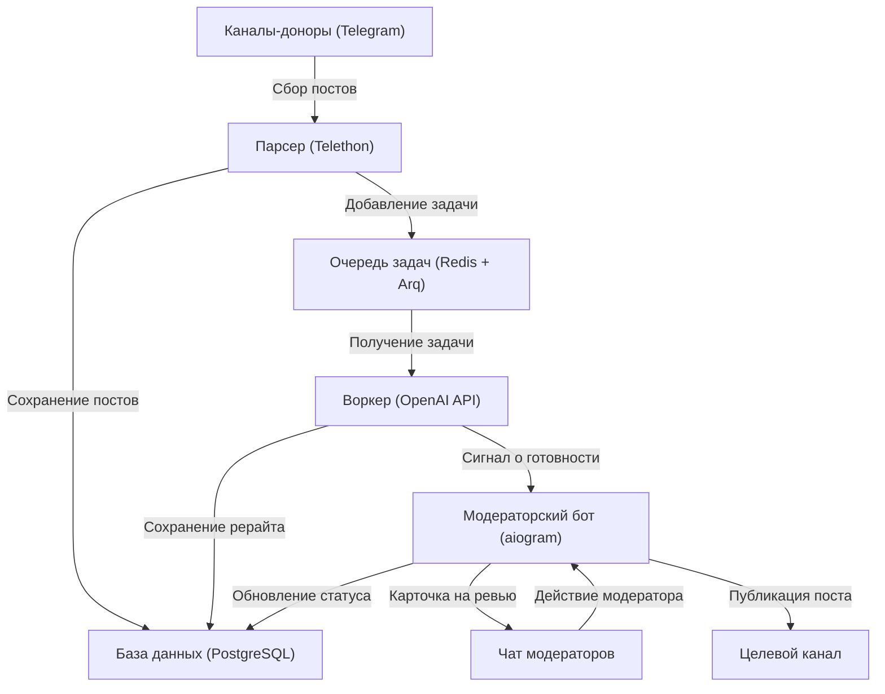

*English version coming soon*

# Telegram Channel Admin (AI Moderator)

[](https://www.python.org)
[](https://www.docker.com)
[](https://github.com/aiogram/aiogram)
[](https://www.postgresql.org)
[](https://redis.io)
[](https://openai.com)

Автоматизированный конвейер для администраторов Telegram-каналов. Система собирает посты из каналов-доноров, фильтрует спам и рекламу, переписывает контент с помощью языковых моделей (LLM) для обеспечения уникальности и отправляет готовый результат в чат модерации. Публикация в целевой канал происходит в один клик.

## Решаемая проблема

Создание уникального контента требует много времени. Простое копирование контента вредит охватам и репутации канала. Данный проект автоматизирует рутину: парсит первоисточники, выполняет качественный рерайт через нейросеть и предоставляет удобный интерфейс модерации перед публикацией.

---

## Архитектура системы

Проект разбит на независимые микросервисы, чтобы тяжелые задачи (парсинг, запросы к API нейросетей) не блокировали интерфейс модерации и базу данных.



### Компоненты:
1. **Parser (Telethon)**: Работает под видом клиента Telegram (Userbot), слушает выбранные каналы. Сохраняет новые посты в PostgreSQL. Использует атомарный `INSERT ... ON CONFLICT DO NOTHING` для мгновенного отсечения дубликатов на уровне СУБД.
2. **Очередь (Redis + Arq)**: Обеспечивает асинхронную доставку задач. Arq выбран за высокую скорость и бесшовную интеграцию с `asyncio`.
3. **Worker (Arq + AsyncOpenAI)**: Проверяет текст по словарю стоп-слов. Если рекламы нет, отправляет запрос к LLM. Реализован кастомный Exponential Backoff для обработки лимитов API. Во время сетевых запросов сессия БД закрывается, предотвращая утечку пула соединений. Дубликаты отменяются автоматически.
4. **Bot (aiogram)**: Отправляет модераторам карточки постов. Поддерживает публикацию, отклонение и редактирование (`/edit`) прямо в Telegram. Защищен от одновременного нажатия разными модераторами с помощью оптимистических блокировок.


---

## Развертывание и настройка

Развертывание системы осуществляется через Docker Compose и занимает около 10 минут.

### Шаг 1. Подготовка API-ключей

1. **Telegram API (Userbot)**:
   - Зайдите на [my.telegram.org](https://my.telegram.org) и авторизуйтесь под своим номером телефона.
   - Перейдите в раздел **API development tools**.
   - Создайте новое приложение (заполните любое имя и короткое имя).
   - Скопируйте полученные значения `API_ID` (число) и `API_HASH` (строка). Это необходимо для авторизации парсера (Telethon).
2. **Telegram Bot Token (Модератор)**:
   - Откройте чат с [@BotFather](https://t.me/BotFather) в Telegram.
   - Отправьте команду `/newbot`, задайте имя и уникальный юзернейм для вашего бота.
   - Скопируйте выданный токен (`TELEGRAM_BOT_TOKEN`).
3. **OpenAI API Key**:
   - Зайдите в личный кабинет OpenAI (или используйте адрес вашего API-провайдера/прокси).
   - Создайте новый API-ключ (`AI_API_KEY`) с доступом к модели `gpt-4o-mini` (или другой на ваш выбор).

### Шаг 2. Настройка окружения

1. Скопируйте шаблон файла конфигурации в рабочий файл `.env`:
   ```bash
   cp .env.example .env
   ```
2. Откройте файл `.env` в текстовом редакторе и настройте параметры.
   > **Важно:** Убедитесь, что параметры подключения в `DATABASE_URL` соответствуют значениям `POSTGRES_USER`, `POSTGRES_PASSWORD` и `POSTGRES_DB`.

| Переменная | Описание | Пример значения |
|---|---|---|
| `POSTGRES_DB` | Имя базы данных PostgreSQL | `tg_admin` |
| `POSTGRES_USER` | Пользователь PostgreSQL | `postgres` |
| `POSTGRES_PASSWORD` | Пароль PostgreSQL | `secure_password` |
| `DATABASE_URL` | Строка подключения к БД | `postgresql+asyncpg://postgres:secure_password@db:5432/tg_admin` |
| `REDIS_URL` | Строка подключения к Redis | `redis://redis:6379/0` |
| `TELEGRAM_BOT_TOKEN` | Токен модераторского бота | `123456:ABC-DEF...` |
| `ADMIN_IDS` | ID аккаунтов модераторов через запятую (для проверки прав) | `123456789,987654321` |
| `TARGET_CHANNEL_ID` | ID канала, куда публикуются одобренные посты | `-1001234567890` |
| `MODERATOR_CHAT_ID` | ID группы/чата, куда бот присылает карточки на ревью | `-1001987654321` |
| `API_ID` | Telegram API ID (полученный на my.telegram.org) | `1234567` |
| `API_HASH` | Telegram API Hash (полученный на my.telegram.org) | `abcdef0123456789abcdef0123456789` |
| `CHANNELS_TO_TRACK` | Юзернеймы или ID каналов-доноров для парсинга (через запятую) | `channel1, @channel2, -1001111111` |
| `AI_API_KEY` | Ключ доступа к OpenAI API | `sk-proj-...` |
| `AI_BASE_URL` | Базовый URL API (оставьте пустым для OpenAI или укажите прокси) | `https://api.openai.com/v1` |
| `AI_MODEL` | Используемая модель ИИ для рерайта | `gpt-4o-mini` |
| `AD_KEYWORDS` | Стоп-слова для фильтрации рекламы (регистронезависимо, через запятую) | `реклама, промокод, подписывайтесь` |
| `OPENAI_EXTRA_BODY` | Опциональные параметры JSON для тонкой настройки запросов к API | `{"temperature": 0.7}` |

### Шаг 3. Авторизация сессии парсера

Парсер использует клиентскую сессию Telegram (Telethon), которую необходимо авторизовать один раз перед запуском основного приложения:

1. Запустите СУБД и Redis в фоновом режиме:
   ```bash
   docker compose up -d redis db
   ```
2. Запустите скрипт интерактивного входа:
   ```bash
   docker compose run --rm parser python src/login.py
   ```
3. Скрипт попросит ввести номер телефона (в международном формате, например, `+79991234567`) и код подтверждения, который придет в ваше приложение Telegram.
4. После успешного входа в примонтированной папке `data/` будет создан файл авторизованной сессии `anon.session`. Данный файл позволяет боту работать без постоянного ввода СМС/кодов.

### Шаг 4. Полный запуск проекта

Теперь можно запустить все сервисы. Контейнер `migrator` автоматически применит миграции базы данных Alembic и завершит работу, а остальные сервисы останутся работать в фоне.

```bash
docker compose up -d --build
```

#### Полезные команды при работе:
* **Проверить статус контейнеров**:
  ```bash
  docker compose ps
  ```
* **Просмотреть логи в реальном времени**:
  ```bash
  docker compose logs -f
  ```
* **Логи конкретного сервиса** (например, воркера):
  ```bash
  docker compose logs -f worker
  ```
* **Остановить приложение**:
  ```bash
  docker compose down
  ```
* **Остановить с удалением сохраненных данных (полный сброс)**:
  ```bash
  docker compose down -v
  ```

---

## Управление потоком и команды бота

Система управления постами поддерживает полный контроль процесса парсинга, отправки и фильтрации прямо из интерфейса Telegram-бота.

### Главные изменения
* **Защита от завала**: В режиме `auto` (по умолчанию) в боте на модерации будет находиться строго 1 пост. За ним в очереди копятся еще 5 постов. Как только лимит исчерпан, парсер перестает скачивать новые посты и полностью их игнорирует.
* **Интервалы**: Посты больше не приходят очередью. Установите интервал, и воркер будет выдерживать заданное время перед тем, как прислать следующий текст на модерацию.
* **Пауза**: Возможность приостановки парсера.
* **Кураторский режим**: Бот может накапливать посты в базу без автоматического рерайта и отправки. По команде ИИ проанализирует накопленное за последние X часов и выберет один лучший пост.

### Команды бота
Эти команды отправляются в чат модерации:

#### Режимы работы
* `/mode auto` — включить автоматический режим (с жесткими лимитами очереди).
* `/mode curation` — включить тихий кураторский режим (сбор постов без рерайта).

#### Кураторство
* `/best` — проанализировать корзину за последние 12 часов и выбрать 1 лучший пост.
* `/best 24h` (или `30m`, `2d`) — выбрать лучший пост за указанное время.

#### Интервалы
* `/interval 20m-50m` — случайная задержка от 20 до 50 минут перед выдачей следующего поста из очереди.
* `/interval 30m` — фиксированная задержка в 30 минут.
* `/interval 0` — отключить задержку (посты будут приходить сразу по мере обработки ИИ, но с учетом лимитов очереди).

#### Пауза и статус
* `/pause` — приостановить парсер навсегда (до ручной активации).
* `/pause 8h` — приостановить парсер на 8 часов.
* `/resume` — возобновить работу парсера досрочно.
* `/status` — посмотреть текущую загруженность очереди, выбранный режим и время до снятия паузы.
* `/clear` — удалить все посты, ожидающие модерации, и очистить кураторскую корзину.

> [!TIP]
> Команды времени поддерживают суффиксы: `m` (минуты), `h` (часы), `d` (дни). Если суффикс не указан, по умолчанию используются минуты. Например, `/pause 30` и `/pause 30m` — это одно и то же.

---

## Безопасность и надежность

- **Безопасность данных**: Файлы `.env` и `data/anon.session` содержат конфиденциальные данные и защищены от попадания в публичный репозиторий через `.gitignore`. Никогда не передавайте их третьим лицам.
- **Ограничение доступа**: Бот проверяет ID отправителя по списку `ADMIN_IDS`. Запросы от сторонних пользователей игнорируются.
- **Отказоустойчивость**: Архитектура гарантирует сохранность данных при перезапуске контейнеров. Задачи в очереди Arq сохраняются в Redis, а транзакции СУБД защищены от взаимных блокировок.
