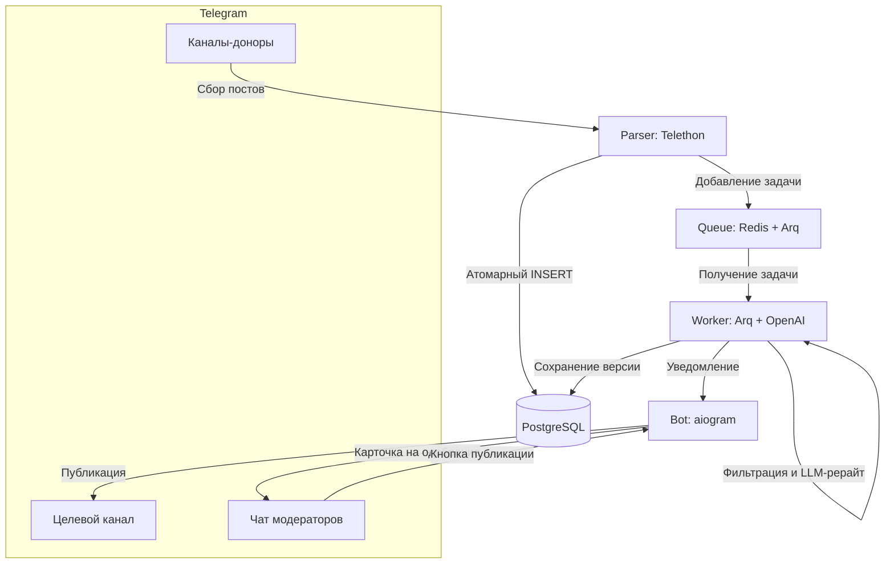

# Telegram Channel Admin (AI Moderator)

[](https://www.python.org)
[](https://www.docker.com)
[](https://github.com/aiogram/aiogram)
[](https://www.postgresql.org)
[](https://redis.io)
[](https://openai.com)

Автоматизированный конвейер для администраторов Telegram-каналов. Система собирает посты из каналов-доноров, фильтрует спам и рекламу, переписывает контент с помощью языковых моделей (LLM) для обеспечения уникальности и отправляет готовый результат в чат модерации. Публикация в целевой канал происходит в один клик.

## Решаемая проблема

Создание уникального контента требует много времени. Простое копирование контента вредит охватам и репутации канала. Данный проект автоматизирует рутину: парсит первоисточники, выполняет качественный рерайт через нейросеть и предоставляет удобный интерфейс модерации перед публикацией.

---

## Архитектура системы

Проект разбит на независимые микросервисы, чтобы тяжелые задачи (парсинг, запросы к API нейросетей) не блокировали интерфейс модерации и базу данных.



### Компоненты:
1. **Parser (Telethon)**: Работает под видом клиента Telegram (Userbot), слушает выбранные каналы. Сохраняет новые посты в PostgreSQL. Использует атомарный `INSERT ... ON CONFLICT DO NOTHING` для мгновенного отсечения дубликатов на уровне СУБД.
2. **Очередь (Redis + Arq)**: Обеспечивает асинхронную доставку задач. Arq выбран за высокую скорость и бесшовную интеграцию с `asyncio`.
3. **Worker (Arq + AsyncOpenAI)**: Проверяет текст по словарю стоп-слов. Если рекламы нет, отправляет запрос к LLM. Реализован кастомный Exponential Backoff для обработки лимитов API. Во время сетевых запросов сессия БД закрывается, предотвращая утечку пула соединений. Дубликаты отменяются автоматически.
4. **Bot (aiogram)**: Отправляет модераторам карточки постов. Поддерживает публикацию, отклонение и редактирование (`/edit`) прямо в Telegram. Защищен от одновременного нажатия разными модераторами с помощью оптимистических блокировок.

---

## Развертывание и настройка

Развертывание системы осуществляется через Docker Compose и занимает около 10 минут.

### Шаг 1. Подготовка API-ключей

1. Получите `API_ID` и `API_HASH` на [my.telegram.org](https://my.telegram.org) в разделе *API development tools*.
2. Создайте бота через @BotFather и сохраните его токен (`TELEGRAM_BOT_TOKEN`).
3. Получите ключ к API OpenAI (`AI_API_KEY`).

### Шаг 2. Настройка окружения

Скопируйте файл конфигурации:
```bash
cp .env.example .env
```
Заполните переменные в созданном файле `.env`:

| Переменная | Описание | Пример значения |
|---|---|---|
| `POSTGRES_DB` | Имя базы данных PostgreSQL | `tg_admin` |
| `POSTGRES_USER` | Пользователь PostgreSQL | `postgres` |
| `POSTGRES_PASSWORD` | Пароль PostgreSQL | `secure_password` |
| `DATABASE_URL` | Строка подключения к БД | `postgresql+asyncpg://postgres:pass@db:5432/tg_admin` |
| `REDIS_URL` | Строка подключения к Redis | `redis://redis:6379/0` |
| `TELEGRAM_BOT_TOKEN` | Токен модераторского бота | `123456:ABC-DEF...` |
| `ADMIN_IDS` | ID администраторов (через запятую) | `123456789,987654321` |
| `TARGET_CHANNEL_ID` | ID канала для публикации | `-1001234567890` |
| `MODERATOR_CHAT_ID` | ID чата модерации | `-1001987654321` |
| `API_ID` | Telegram API ID | `1234567` |
| `API_HASH` | Telegram API Hash | `abcdef0123456789abcdef0123456789` |
| `CHANNELS_TO_TRACK` | Юзернеймы или ID доноров | `channel1, @channel2, -1001111111` |
| `AI_API_KEY` | Ключ OpenAI API / Proxy | `sk-proj-...` |
| `AI_BASE_URL` | Базовый URL API (для прокси/локальных моделей) | `https://api.openai.com/v1` |
| `AI_MODEL` | Используемая модель ИИ | `gpt-4o-mini` |
| `AD_KEYWORDS` | Стоп-слова для рекламы (через запятую) | `реклама, промокод, подписывайтесь` |
| `OPENAI_EXTRA_BODY` | Опциональные параметры JSON для API | `{"temperature": 0.7}` |

### Шаг 3. Авторизация сессии парсера

Парсер работает через Telethon и требует авторизации по номеру телефона:

1. Запустите базы данных:
   ```bash
   docker compose up -d redis db
   ```
2. Запустите скрипт интерактивной авторизации:
   ```bash
   docker compose run --rm parser python src/login.py
   ```
3. Введите номер телефона и код подтверждения из Telegram. В папке `data/` будет сохранен файл сессии `anon.session`.

### Шаг 4. Запуск приложения

Запустите все сервисы в фоновом режиме. Миграции базы данных применятся автоматически через контейнер `migrator`:

```bash
docker compose up -d --build
```

- Проверка статуса контейнеров: `docker compose ps`
- Просмотр логов: `docker compose logs -f`

---

## Безопасность и надежность

- **Безопасность данных**: Файлы `.env` и `data/anon.session` содержат конфиденциальные данные и защищены от попадания в публичный репозиторий через `.gitignore`. Никогда не передавайте их третьим лицам.
- **Ограничение доступа**: Бот проверяет ID отправителя по списку `ADMIN_IDS`. Запросы от сторонних пользователей игнорируются.
- **Отказоустойчивость**: Архитектура гарантирует сохранность данных при перезапуске контейнеров. Задачи в очереди Arq сохраняются в Redis, а транзакции СУБД защищены от взаимных блокировок.
