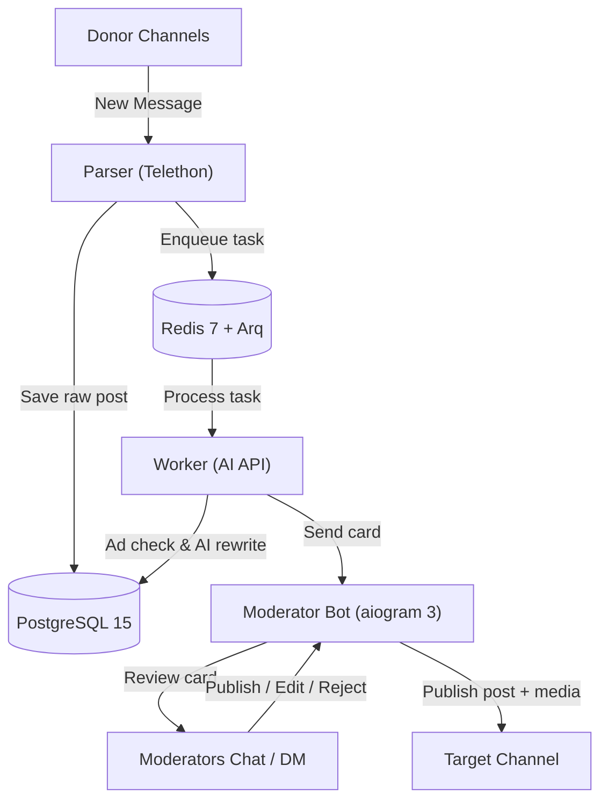

*Russian version available in [README_ru.md](README_ru.md) | Author's Channel: [t.me/ivanchik_byte](https://t.me/ivanchik_byte)*

# Telegram Channel Admin (AI Moderator & Content Curator)

[](https://www.python.org)
[](https://www.docker.com)
[](https://github.com/aiogram/aiogram)
[](https://github.com/LonamiWebs/Telethon)
[](https://www.postgresql.org)
[](https://redis.io)
[](https://t.me/ivanchik_byte)
[](https://t.me/ivanchikbyte)
[](LICENSE)

An asynchronous microservice pipeline and Telegram bot for channel administrators. It automatically monitors donor channels, filters out ads, generates unique rewrites using AI (OpenAI, DeepSeek, or any compatible API), and delivers interactive moderation cards to publish, reject, or edit posts in one click.

---

## Features

- **Automated Channel Monitoring**: Captures posts and media from donor channels via Telethon (MTProto Userbot).
- **Ad & Spam Filtering**: Automatically discards ads, promo codes, referral links, and stop-words before AI processing.
- **AI Rewriting**: Transforms raw news into structured, native Telegram posts using any OpenAI-compatible API.
- **Smart Deduplication**: Hashes normalized post text to prevent duplicates across multiple sources.
- **Interactive Moderation Cards**: Inline buttons in Telegram for Publish, Reject, Edit Text, Change Media, and AI Re-Prompting.
- **Anti-Flood & Pacing**: Configurable random or fixed delays between posts to avoid spamming the channel.
- **Manual Post Submission**: Send any text or media directly to the bot in private messages for instant AI rewrite.
- **Curation Mode**: Collect posts in a buffer and let AI pick the top 6 most viral posts over the last 24 hours (`/best`).
- **Dual Localization**: Independent selection of bot UI language (`ru`/`en`) and AI post generation language (`ru`/`en`).

---

## Architecture


```mermaid
flowchart TD
    Donors["Donor Channels"] -->|New Message| Parser["Parser (Telethon)"]
    Parser -->|Save raw post| DB[("PostgreSQL 15")]
    Parser -->|Enqueue task| Queue[("Redis 7 + Arq")]
    Queue -->|Process task| Worker["Worker (AI API)"]
    Worker -->|Ad check & AI rewrite| DB
    Worker -->|Send card| Bot["Moderator Bot (aiogram 3)"]
    Bot -->|Review card| ModChat["Moderators Chat / DM"]
    ModChat -->|Publish / Edit / Reject| Bot
    Bot -->|Publish post + media| Target["Target Channel"]
```

---

## Installation & Setup

### Prerequisites

- **Docker** and **Docker Compose v2**
- **Telegram Account** phone number (for Telethon Userbot)
- **Telegram Bot Token** from [@BotFather](https://t.me/BotFather)
- **Telegram API ID & API Hash** from [my.telegram.org](https://my.telegram.org)
- **AI API Key** (OpenAI, DeepSeek, OpenRouter, etc.)

---

### Step 1: Clone the Repository

```bash
git clone https://github.com/ivanchik-byte/Telegram-Channel-Admin.git
cd Telegram-Channel-Admin
```

---

### Step 2: Configure Environment Variables

Create your `.env` configuration file:

```bash
cp .env.example .env
```

Open `.env` and fill in your credentials:

```ini
# PostgreSQL Database
POSTGRES_USER=postgres
POSTGRES_PASSWORD=your_secure_password
POSTGRES_DB=tg_admin
DATABASE_URL=postgresql+asyncpg://postgres:your_secure_password@db:5432/tg_admin

# Redis
REDIS_URL=redis://redis:6379/0

# Telegram MTProto API (from my.telegram.org)
API_ID=12345678
API_HASH=abcdef0123456789abcdef0123456789

# Donor Channels to Monitor (comma-separated IDs or usernames)
CHANNELS_TO_TRACK=-1001234567890,@channel_username,donor_channel

# Telegram Bot Settings
TELEGRAM_BOT_TOKEN=123456789:ABCdefGHIjklMNOpqrSTUvwxYZ
TARGET_CHANNEL_ID=-1001234567890
MODERATOR_CHAT_ID=-1001987654321
ADMIN_IDS=123456789

# AI Provider Settings
AI_API_KEY=sk-proj-your-key-here
AI_BASE_URL=https://api.openai.com/v1
AI_MODEL=gpt-4o-mini
AD_KEYWORDS=реклама,erid,промокод,подписывайтесь,скидка,розыгрыш,promo
OPENAI_EXTRA_BODY={"temperature": 0.7}

# Default UI Language (ru / en)
LANGUAGE=en
```

> **Note on Telegram IDs:**
> - Find your user ID via [@userinfobot](https://t.me/userinfobot).
> - Add your bot as an administrator to both your **Moderator Group** and your **Target Channel**.
> - Channel/group IDs must include the `-100...` prefix.

---

### Step 3: Authorize the Parser (One-Time Login)

Telethon needs a valid user session file (`data/anon.session`) to read donor channels:

1. Start the database and Redis services:
   ```bash
   docker compose up -d db redis
   ```

2. Run the authorization script inside a temporary container:
   ```bash
   docker compose run --rm parser python src/login.py
   ```

3. Enter your phone number, the verification code from Telegram, and your 2FA password (if enabled).

---

### Step 4: Build and Start All Services

Launch the full stack in the background:

```bash
docker compose up -d --build
```

Check that all containers are running:

```bash
docker compose ps
```

---

### Step 5: Initial Bot Setup

1. Open Telegram and send `/start` to your bot.
2. Select your preferred **UI Language** and **AI Post Generation Language** from the interactive buttons.
3. The moderation dashboard and control keyboard are now active.

---

## Bot Commands Reference

| Command | Arguments | Mode | Description | Example |
| :--- | :--- | :--- | :--- | :--- |
| `/start` | None | Any | Initialize bot and configure languages | `/start` |
| `/status` | None | Any | Display system status, queue size, and control buttons | `/status` |
| `/mode` | `<auto \| curation>` | Any | Switch between real-time processing (`auto`) and buffering (`curation`) | `/mode auto` |
| `/interval` | `<time \| range \| 0>` | Any | Set pacing interval between posts. `0` disables delays | `/interval 20-50`, `/interval 5m`, `/interval 0` |
| `/pause` | `[duration]` | Any | Pause post collection indefinitely or for a specific time | `/pause 8h`, `/pause` |
| `/resume` | None | Any | Resume post collection | `/resume` |
| `/queue` | `[limit]` | Auto | View or update maximum queued posts limit (default: 5) | `/queue 10` |
| `/best` | `[period]` | Curation | AI selects top 6 posts from accumulator for specified period | `/best 24h`, `/best` |
| `/parse` | `[time\|count],[channels]` | Any | Force fetch past posts from donor channels | `/parse 24h,5`, `/parse 10,2` |
| `/mod` | None | Any | Request the oldest queued post for immediate review | `/mod` |
| `/edit` | `<id> <text>` | Any | Edit rewritten text of a pending post by ID | `/edit 15 New post text` |
| `/lang` | None | Any | Change interface language or AI generation language | `/lang` |
| `/clear` | None | Any | Cancel all currently queued and moderating posts | `/clear` |
| `/clear_db` | None | Any | Delete all processed posts from database | `/clear_db` |
| `/help` | None | Any | Show commands cheat sheet | `/help` |

---

## Moderation Card Workflow

When a post is ready, the bot sends an interactive card to your moderation chat:

- **Publish**: Posts formatted HTML text and media to your target channel, cleans up temporary files, and starts the interval timer.
- **Reject**: Cancels the post and removes attached media.
- **Edit Text**: Prompts for new text in chat or via `/edit <id> <text>`.
- **Change Media**: Upload a replacement image/video or remove media.
- **AI Edit**: Provide a prompt instruction (e.g. *"make it shorter"*, *"add humor"*) to regenerate the text with AI.
- **Source Links**: Non-Telegram links and the original post link are provided in a follow-up message for quick fact-checking.

---

## Operational Commands

```bash
# View live logs from all services
docker compose logs -f

# View logs from a specific service
docker compose logs -f bot
docker compose logs -f worker
docker compose logs -f parser

# Restart all services with rebuild
docker compose down
docker compose up -d --build

# Run database migrations
docker compose run --rm migrator alembic upgrade head

# Wipe database and reset queue (WARNING: deletes all post data)
docker compose down -v
```

---

## Contacts & Author

- Telegram Channel: [t.me/ivanchik_byte](https://t.me/ivanchik_byte)
- Telegram Direct: [t.me/ivanchikbyte](https://t.me/ivanchikbyte)

---

## License

This project is licensed under the **MIT License**. See the [LICENSE](LICENSE) file for details.
