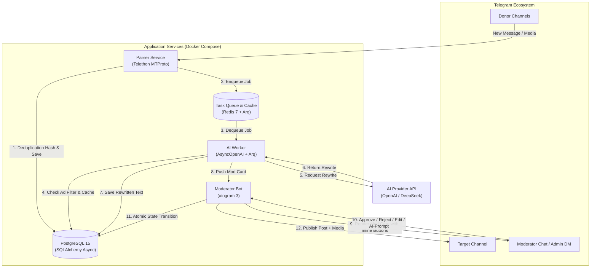
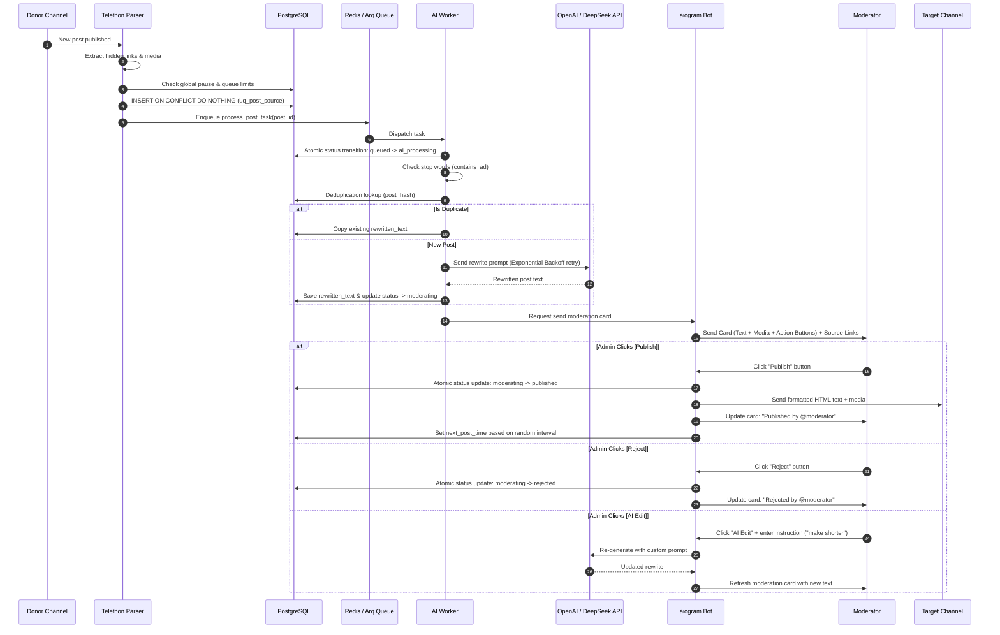

*Русская версия доступна вот тут [README_ru.md](README_ru.md)*

# Telegram Channel Admin (AI Moderator & Content Curator)

[](https://www.python.org)
[](https://www.docker.com)
[](https://github.com/aiogram/aiogram)
[](https://github.com/LonamiWebs/Telethon)
[](https://www.postgresql.org)
[](https://redis.io)
[](https://github.com/samuelcolvin/arq)
[](https://platform.openai.com)
[](LICENSE)

An asynchronous, microservice-based content pipeline and AI moderator bot for Telegram channel administrators. The system autonomously captures posts from donor channels, filters out advertisements, performs high-quality rewrites using LLMs, downloads media attachments, and delivers structured moderation cards to administrators for one-click publishing, manual editing, or interactive AI re-prompting.

---

## Table of Contents

- [Overview & Key Features](#overview--key-features)
- [Tech Stack](#tech-stack)
- [Architecture & System Design](#architecture--system-design)
  - [High-Level Microservice Diagram](#high-level-microservice-diagram)
  - [Post Processing Lifecycle (Sequence Diagram)](#post-processing-lifecycle-sequence-diagram)
  - [Directory Structure](#directory-structure)
  - [Database Schema & State Machine](#database-schema--state-machine)
- [Prerequisites](#prerequisites)
- [Getting Started & Installation](#getting-started--installation)
  - [Step 1: Clone Repository](#step-1-clone-repository)
  - [Step 2: Telegram API & Bot Setup](#step-2-telegram-api--bot-setup)
  - [Step 3: Environment Configuration](#step-3-environment-configuration)
  - [Step 4: AI Prompt Customization](#step-4-ai-prompt-customization)
  - [Step 5: Telethon Session Authorization](#step-5-telethon-session-authorization)
  - [Step 6: Launch Services with Docker Compose](#step-6-launch-services-with-docker-compose)
  - [Step 7: Initial Bot Configuration Wizard](#step-7-initial-bot-configuration-wizard)
- [Bot Management & User Manual](#bot-management--user-manual)
  - [Operating Modes: Auto vs Curation](#operating-modes-auto-vs-curation)
  - [Complete Bot Command Reference](#complete-bot-command-reference)
  - [Interactive Moderation Cards](#interactive-moderation-cards)
  - [Status Dashboard & Controls](#status-dashboard--controls)
  - [Smart Interval Scheduling & Queue Limits](#smart-interval-scheduling--queue-limits)
  - [AI Curation Mode (/best)](#ai-curation-mode-best)
  - [Manual Post Submissions](#manual-post-submissions)
  - [Dual-Language System (UI & Post Generation)](#dual-language-system-ui--post-generation)
- [Environment Variables Reference](#environment-variables-reference)
- [Operational & CLI Commands](#operational--cli-commands)
- [Production Deployment & Best Practices](#production-deployment--best-practices)
- [Security Considerations](#security-considerations)
- [Troubleshooting & FAQ](#troubleshooting--faq)
- [Contacts & Author](#contacts--author)
- [License](#license)

---

## Overview & Key Features

Maintaining an active Telegram channel with high-quality, unique content is demanding. Manually copy-pasting posts ruins your brand reputation and search reach, while constantly writing original news takes hours every day.

**Telegram Channel Admin** automates the entire content workflow:
- **Automated Channel Ingestion**: Seamlessly tracks multiple public and private Telegram channels using Telethon (Userbot MTProto API).
- **Ad & Spam Filtering**: Automatically drops sponsored messages, spam keywords, promo codes, giveaway links, and referral spam before hitting the AI.
- **Context-Aware AI Rewriter**: Connects with any OpenAI-compatible API (OpenAI GPT-4o, DeepSeek, OpenRouter, Mistral, Ollama, Groq) to craft native, engaging posts formatted specifically for Telegram.
- **Asynchronous Task Queue**: Powered by Redis and Arq with automatic exponential backoff retry mechanisms on rate-limits (HTTP 429 / 5xx) and connection drops.
- **Smart Deduplication**: MD5 text-normalization hashing prevents duplicate posts from multiple donor channels. If a duplicate arrives, it reuses the already generated AI rewrite instead of making redundant API calls.
- **Interactive Moderation Cards**: Delivers formatted Telegram cards with inline buttons to **Publish**, **Reject**, **Manually Edit**, **Change Media**, or **AI Re-Prompt** (e.g. *"make it funnier"*, *"shorten to 2 lines"*).
- **Pacing & Anti-Flood Intervals**: Configurable random or fixed intervals (e.g. `20-50s`, `5m`) between posts to prevent flooding your moderators and target channels.
- **Manual Post Ingestion**: Send any text, photo, video, or document directly to the bot in private messages to trigger an instant AI rewrite card.
- **Curation Mode**: Buffer incoming posts without instant rewriting, then let the AI analyze 24 hours of news to pick the top 6 most viral posts.
- **Dual-Language Localization**: Separate controls for the moderator bot interface language (`ru` / `en`) and the target channel publication language (`ru` / `en`).

---

## Tech Stack

| Layer | Technology | Purpose |
| :--- | :--- | :--- |
| **Language** | Python 3.11 | Modern async/await runtime with strict typing |
| **Telegram Bot** | [aiogram 3.10](https://github.com/aiogram/aiogram) | Fast, asynchronous Telegram Bot API framework with FSM and router architecture |
| **Telegram Userbot** | [Telethon 1.35](https://github.com/LonamiWebs/Telethon) | MTProto client library for monitoring donor channels and downloading media |
| **Database** | PostgreSQL 15 | Relational storage for posts, configuration, deduplication hashes, and statuses |
| **ORM & Migrations** | SQLAlchemy 2.0 (Async) + Alembic | Async ORM with `asyncpg` driver and declarative schema migrations |
| **Task Queue** | [Arq 0.26](https://github.com/samuelcolvin/arq) + Redis 7 | High-performance asynchronous job queue and distributed scheduling |
| **AI / LLM Integration** | AsyncOpenAI + httpx | OpenAI SDK compatible with OpenAI, DeepSeek, OpenRouter, and local models |
| **Settings & Validation**| Pydantic v2 & Pydantic-Settings | Strongly-typed configuration loaded from environment variables |
| **Containerization** | Docker & Docker Compose | Multi-stage builds and isolated microservice container orchestration |

---

## Architecture & System Design

The application is architected as an isolated, asynchronous microservice cluster. Heavy network operations (parsing Telegram channels, querying AI APIs) are decoupled from the interactive moderation bot and the database to prevent bottlenecks and deadlocks.

### High-Level Microservice Diagram


```mermaid
flowchart TD
    subgraph Telegram["Telegram Ecosystem"]
        DonorChannels["Donor Channels"]
        TargetChannel["Target Channel"]
        ModChat["Moderator Chat / Admin DM"]
    end

    subgraph CoreServices["Application Services (Docker Compose)"]
        Parser["Parser Service<br/>(Telethon MTProto)"]
        RedisQueue[("Task Queue & Cache<br/>(Redis 7 + Arq)")]
        Worker["AI Worker<br/>(AsyncOpenAI + Arq)"]
        Bot["Moderator Bot<br/>(aiogram 3)"]
        DB[("PostgreSQL 15<br/>(SQLAlchemy Async)")]
    end

    DonorChannels -->|New Message / Media| Parser
    Parser -->|1. Deduplication Hash & Save| DB
    Parser -->|2. Enqueue Job| RedisQueue
    RedisQueue -->|3. Dequeue Job| Worker
    Worker -->|4. Check Ad Filter & Cache| DB
    Worker -->|5. Request Rewrite| AI_API["AI Provider API<br/>(OpenAI / DeepSeek)"]
    AI_API -->|6. Return Rewrite| Worker
    Worker -->|7. Save Rewritten Text| DB
    Worker -->|8. Push Mod Card| Bot
    Bot -->|9. Render Mod Card with Inline Buttons| ModChat
    ModChat -->|10. Approve / Reject / Edit / AI-Prompt| Bot
    Bot -->|11. Atomic State Transition| DB
    Bot -->|12. Publish Post + Media| TargetChannel
```

### Post Processing Lifecycle (Sequence Diagram)


```mermaid
sequenceDiagram
    autonumber
    participant Donor as Donor Channel
    participant Parser as Telethon Parser
    participant DB as PostgreSQL
    participant Redis as Redis / Arq Queue
    participant Worker as AI Worker
    participant LLM as OpenAI / DeepSeek API
    participant Bot as aiogram Bot
    participant Admin as Moderator
    participant Target as Target Channel

    Donor->>Parser: New post published
    Parser->>Parser: Extract hidden links & media
    Parser->>DB: Check global pause & queue limits
    Parser->>DB: INSERT ON CONFLICT DO NOTHING (uq_post_source)
    Parser->>Redis: Enqueue process_post_task(post_id)
    Redis->>Worker: Dispatch task
    Worker->>DB: Atomic status transition: queued -> ai_processing
    Worker->>Worker: Check stop words (contains_ad)
    Worker->>DB: Deduplication lookup (post_hash)
    alt Is Duplicate
        Worker->>DB: Copy existing rewritten_text
    else New Post
        Worker->>LLM: Send rewrite prompt (Exponential Backoff retry)
        LLM-->>Worker: Rewritten post text
        Worker->>DB: Save rewritten_text & update status -> moderating
    end
    Worker->>Bot: Request send moderation card
    Bot->>Admin: Send Card (Text + Media + Action Buttons) + Source Links
    
    alt Admin Clicks [Publish]
        Admin->>Bot: Click "Publish" button
        Bot->>DB: Atomic status update: moderating -> published
        Bot->>Target: Send formatted HTML text + media
        Bot->>Admin: Update card: "Published by @moderator"
        Bot->>DB: Set next_post_time based on random interval
    else Admin Clicks [Reject]
        Admin->>Bot: Click "Reject" button
        Bot->>DB: Atomic status update: moderating -> rejected
        Bot->>Admin: Update card: "Rejected by @moderator"
    else Admin Clicks [AI Edit]
        Admin->>Bot: Click "AI Edit" + enter instruction ("make shorter")
        Bot->>LLM: Re-generate with custom prompt
        LLM-->>Bot: Updated rewrite
        Bot->>Admin: Refresh moderation card with new text
    end
```

### Directory Structure

```
TG_Channel_Bot/
├── alembic/                       # Alembic database migration scripts
│   ├── env.py                     # Async migration runner environment
│   └── versions/                  # Versioned SQL migration files
├── data/                          # Persistent storage (mounted in Docker)
│   ├── anon.session               # Telethon MTProto user session file
│   └── media/                     # Downloaded photos, videos, and documents
├── src/                           # Application source code
│   ├── bot/                       # Telegram Moderator Bot (aiogram 3)
│   │   ├── handlers.py            # Command handlers, FSM states, callbacks & UI
│   │   └── main.py                # Bot startup and polling lifecycle
│   ├── core/                      # Core cross-cutting components
│   │   ├── config.py              # Pydantic Settings & environment validation
│   │   ├── constants.py           # Telegram limits & system constants
│   │   ├── i18n.py                # Dual-language translations dictionary (RU/EN)
│   │   ├── logger.py              # Centralized logging configuration
│   │   ├── prompts.py             # System prompts for AI rewriting (RU/EN)
│   │   └── utils.py               # HTML sanitizers & time parsers
│   ├── database/                  # Database layer
│   │   ├── engine.py              # Async SQLAlchemy engine & session maker
│   │   ├── models.py              # SQLAlchemy ORM models (ProcessedPost, BotSettings)
│   │   └── repository.py          # Atomic database query repositories
│   ├── parser/                    # Channel Ingestion Service (Telethon)
│   │   ├── handlers.py            # Message interceptor & deduplication logic
│   │   ├── join_channels.py       # Helper utility to join donor channels
│   │   └── main.py                # Telethon client loop & force-parse listener
│   ├── worker/                    # Background Task Worker (Arq)
│   │   ├── main.py                # Arq WorkerSettings, startup & shutdown hooks
│   │   └── tasks.py               # AI rewrite tasks, curation, and cleanup cron
│   └── login.py                   # Interactive Telethon authentication script
├── .dockerignore                  # Docker build exclusions
├── .env.example                   # Template environment configuration file
├── .gitignore                     # Git tracking exclusions
├── alembic.ini                    # Alembic configuration
├── clean.py                       # Utility script to truncate processed posts
├── COMMANDS.md                    # Quick Docker administration cheat sheet
├── COMMANDS_ru.md                 # Russian Docker cheat sheet
├── Dockerfile                     # Multi-stage container build definition
├── docker-compose.yml             # Orchestration for all 5 services
├── LICENSE                        # MIT License
├── README.md                      # English documentation (this file)
├── README_ru.md                   # Russian documentation
└── requirements.txt               # Pinned Python package dependencies
```

### Database Schema & State Machine

#### `processed_posts`
| Column | Type | Constraints | Description |
| :--- | :--- | :--- | :--- |
| `id` | `INTEGER` | Primary Key, Auto-increment | Internal unique post identifier |
| `source_channel_id`| `BIGINT` | Indexed | Telegram channel ID of the source post |
| `source_message_id`| `BIGINT` | `uq_post_source` | Message ID inside the source channel |
| `post_hash` | `VARCHAR(64)` | Indexed | MD5 hash of normalized text for deduplication |
| `status` | `VARCHAR(50)` | `chk_status` | Current processing state (see state machine) |
| `text` | `TEXT` | Not Null | Original raw text extracted from the donor post |
| `rewritten_text` | `TEXT` | Nullable | Final AI-generated text ready for publication |
| `media_path` | `VARCHAR(512)`| Nullable | Local file path to downloaded media in `data/media/` |
| `media_type` | `VARCHAR(50)` | Nullable | Media category: `photo`, `video`, `document` |
| `source_link` | `VARCHAR(255)`| Nullable | Direct Telegram URL to the original donor post |
| `created_at` | `TIMESTAMPTZ` | Default `now()` | Ingestion timestamp |

#### `bot_settings`
| Column | Type | Default | Description |
| :--- | :--- | :--- | :--- |
| `id` | `INTEGER` | Primary Key | Settings record ID (singleton) |
| `mode` | `VARCHAR(50)` | `'auto'` | Operating mode: `'auto'` or `'curation'` |
| `interval_min` | `INTEGER` | `0` | Minimum post interval delay in seconds |
| `interval_max` | `INTEGER` | `0` | Maximum post interval delay in seconds |
| `pause_until` | `TIMESTAMPTZ` | `NULL` | Timestamp until post ingestion is paused |
| `next_post_time` | `TIMESTAMPTZ` | `NULL` | Scheduled timestamp for sending the next queued post |
| `queue_limit` | `INTEGER` | `5` | Maximum number of posts held in the review queue |
| `ui_lang` | `VARCHAR(10)` | `'ru'` | Moderator interface language (`'ru'` / `'en'`) |
| `post_lang` | `VARCHAR(10)` | `'ru'` | AI post generation language (`'ru'` / `'en'`) |

#### Post Status State Transitions
```
[seen] --> [queued] --> [ai_processing] --> [moderating] --> [published]
  |           |               |                   |
  |--> [filtered_ad]          |--> [failed]       |--> [rejected]
  |--> [accumulated] (curation)
```

---

## Prerequisites

Before starting the setup, ensure you have the following installed on your machine or VPS:

- **Docker Engine** (version 24.0+) & **Docker Compose v2** (version 2.20+)
- **Git** for repository cloning
- **Telegram Account** (phone number) to authenticate the Telethon parser client
- **Telegram Bot Token** obtained from [@BotFather](https://t.me/BotFather)
- **AI Provider API Key** (OpenAI, DeepSeek, OpenRouter, or local LLM server)

---

## Getting Started & Installation

### Step 1: Clone Repository

```bash
git clone https://github.com/ivanchik-byte/Telegram-Channel-Admin.git
cd Telegram-Channel-Admin
```

### Step 2: Telegram API & Bot Setup

1. **Telegram API Credentials (for Telethon Parser)**:
   - Log in with your phone number at [my.telegram.org](https://my.telegram.org).
   - Navigate to **API development tools**.
   - Create a new app (enter any title and short name).
   - Copy the numeric `App api_id` and string `App api_hash`.

2. **Telegram Moderator Bot Token**:
   - Open Telegram and message [@BotFather](https://t.me/BotFather).
   - Send `/newbot`, choose a name and username.
   - Copy the generated HTTP API Token (e.g. `123456789:ABCdef...`).

3. **Obtain Telegram IDs**:
   - **Your Admin User ID**: Message [@userinfobot](https://t.me/userinfobot) to find your numeric ID.
   - **Moderator Chat / Supergroup ID**: Add your bot to your moderation group, make it an administrator, and send a message. Note the negative ID (e.g. `-1001987654321`).
   - **Target Channel ID**: Add your bot to your public/private target channel as an administrator with *Post Messages* permission. Copy the channel's negative ID (e.g. `-1001234567890`).

### Step 3: Environment Configuration

Copy the example environment configuration:
```bash
cp .env.example .env
```

Open `.env` in your preferred editor (`nano .env` or `vim .env`) and configure the values:

```ini
# PostgreSQL Database Connection
POSTGRES_USER=postgres
POSTGRES_PASSWORD=your_secure_password
POSTGRES_DB=tg_admin
DATABASE_URL=postgresql+asyncpg://postgres:your_secure_password@db:5432/tg_admin

# Redis Cache & Task Queue
REDIS_URL=redis://redis:6379/0

# Telethon Userbot Credentials
API_ID=12345678
API_HASH=abcdef0123456789abcdef0123456789

# Donor Channels to Monitor (IDs or Usernames, comma-separated)
CHANNELS_TO_TRACK=-1001234567890,tech_news_channel,@gaming_insider

# AI Provider Configuration
AI_API_KEY=sk-proj-your-ai-api-key-here
AI_BASE_URL=https://api.openai.com/v1          # Or https://api.deepseek.com/v1
AI_MODEL=gpt-4o-mini                           # Or deepseek-chat, gpt-4o, etc.
AD_KEYWORDS=реклама,erid,промокод,подписывайтесь,скидка,розыгрыш,promo,sponsored
OPENAI_EXTRA_BODY={"temperature": 0.7}

# Telegram Bot Settings
TELEGRAM_BOT_TOKEN=123456789:ABCdefGHIjklMNOpqrSTUvwxYZ
MODERATOR_CHAT_ID=-1001987654321               # Optional: If empty, sends to first admin DM
TARGET_CHANNEL_ID=-1001234567890               # Required: Target channel for published posts
ADMIN_IDS=123456789,987654321                  # Allowed admin Telegram User IDs

# Interface Language (ru / en)
LANGUAGE=en
```

### Step 4: AI Prompt Customization

Before launching, inspect and customize the system prompt to match your channel's unique voice and tone:

- The prompts are defined in [`src/core/prompts.py`](src/core/prompts.py) (`SYSTEM_PROMPT_REWRITE_RU` and `SYSTEM_PROMPT_REWRITE_EN`).
- By default, prompts are tuned for a conversational, engaging, tech & gaming editorial style with formatted Telegram bolding and bulleted lists.
- Adjust the style rules if your channel covers finance, science, crypto, lifestyle, or corporate news.

### Step 5: Telethon Session Authorization

The Telethon parser requires an initial one-time interactive login to create a persistent session file (`data/anon.session`):

1. Start the PostgreSQL and Redis containers:
   ```bash
   docker compose up -d db redis
   ```

2. Run the interactive login script inside a temporary parser container:
   ```bash
   docker compose run --rm parser python src/login.py
   ```

3. Enter your phone number (international format, e.g. `+1234567890`) and the Telegram verification code when prompted. If two-factor authentication (2FA) is enabled, enter your password.
4. Once completed, the session is saved in `data/anon.session`.

### Step 6: Launch Services with Docker Compose

Build and launch all 5 microservices in detached mode:

```bash
docker compose up -d --build
```

Verify that all containers are healthy:
```bash
docker compose ps
```

*Expected output:*
```
NAME                           IMAGE                        COMMAND                  SERVICE      STATUS
tg_channel_bot-db-1            postgres:15-alpine           "docker-entrypoint.s…"   db           Up (healthy)
tg_channel_bot-redis-1         redis:7-alpine               "docker-entrypoint.s…"   redis        Up (healthy)
tg_channel_bot-migrator-1      tg_channel_bot-migrator      "alembic upgrade head"   migrator     Exited (0)
tg_channel_bot-parser-1        tg_channel_bot-parser        "python -m src.parse…"   parser       Up
tg_channel_bot-worker-1        tg_channel_bot-worker        "arq src.worker.main…"   worker       Up
tg_channel_bot-bot-1           tg_channel_bot-bot           "python -m src.bot.m…"   bot          Up
```

### Step 7: Initial Bot Configuration Wizard

1. Open Telegram and send `/start` to your moderator bot.
2. If your User ID is listed in `ADMIN_IDS`, the bot will present an interactive language selection wizard:
   - **Step 1**: Select Interface Language (Russian or English).
   - **Step 2**: Select AI Post Generation Language (Russian or English).
3. The main control keyboard will appear, ready for moderation.

---

## Bot Management & User Manual

### Operating Modes: Auto vs Curation

The bot supports two distinct operational modes:

| Mode | Command | Workflow Description | Best For |
| :--- | :--- | :--- | :--- |
| **Auto** *(Default)* | `/mode auto` | Incoming donor posts are immediately ad-checked, sent to the AI for rewriting, and delivered to the moderation chat one by one with interval delays. | Real-time news channels, breaking updates, 24/7 continuous stream. |
| **Curation** | `/mode curation` | Incoming donor posts are saved raw into the database (`accumulated` status) without triggering AI calls. The admin triggers AI analysis on demand. | Curated digests, top-news roundups, selective daily summaries. |

---

### Complete Bot Command Reference

All commands must be executed by an authorized administrator (listed in `ADMIN_IDS`):

| Command | Arguments | Mode | Description | Example |
| :--- | :--- | :--- | :--- | :--- |
| `/start` | None | Any | Initializes bot session, displays greeting, and opens language setup wizard | `/start` |
| `/status` | None | Any | Displays dynamic dashboard with queue counts, interval timers, and status | `/status` |
| `/mode` | `<auto \| curation>` | Any | Switches between real-time processing (`auto`) and raw accumulation (`curation`) | `/mode auto` |
| `/interval` | `<time \| range \| 0>`| Any | Sets pacing delays between posts. `0` disables delays | `/interval 20-50`, `/interval 5m`, `/interval 0` |
| `/pause` | `[duration]` | Any | Pauses post ingestion indefinitely or for a specified duration | `/pause`, `/pause 8h`, `/pause 30m` |
| `/resume` | None | Any | Unpauses post ingestion immediately | `/resume` |
| `/queue` | `[number]` | Auto | Views or updates the maximum backlog limit of queued posts (default: 5) | `/queue 10` |
| `/best` | `[time_window]` | Curation | Asks AI to evaluate accumulated posts from the last N hours and select the top 6 | `/best`, `/best 24h`, `/best 3d` |
| `/parse` | `[time\|count],[channels]`| Any | Manually triggers Telethon to fetch historical posts from donor channels | `/parse 24h,5`, `/parse 10,2`, `/parse 5` |
| `/mod` | None | Any | Requests the oldest pending post from the queue for immediate moderation | `/mod` |
| `/edit` | `<id> <new_text>` | Any | Overwrites the rewritten text of a pending post directly via command | `/edit 42 Here is the updated text` |
| `/lang` | None | Any | Opens language configuration panel for UI and AI post generation | `/lang` |
| `/clear` | None | Any | Discards all currently active moderating and queued posts | `/clear` |
| `/clear_db`| None | Any | Completely clears all stored posts from the database | `/clear_db` |
| `/help` | None | Any | Shows a comprehensive command and navigation cheat sheet | `/help` |

> [!TIP]
> Time arguments support concise human-readable units: `s` (seconds), `m` (minutes), `h` (hours), `d` (days). Example: `/interval 2m-5m`, `/pause 12h`.

---

### Interactive Moderation Cards

When a post is processed by the AI, it is delivered to the moderator chat as an interactive card:

```
┌────────────────────────────────────────────────────────┐
│ Next-Gen GPU Architecture Announced                    │
│                                                        │
│ NVIDIA has officially revealed its latest Blackwell    │
│ architecture, promising up to 4x faster AI inference   │
│ and significantly reduced power consumption.           │
│                                                        │
│ Shipments are expected to begin later this quarter.    │
└────────────────────────────────────────────────────────┘
[ Publish ]             [ Reject ]
[ Edit Text ]           [ Change Media ]
[ AI Edit (Prompt) ]
```

#### Card Action Buttons:

1. **Publish**:
   - Publishes the post with formatted HTML and attached media (photo, video, document) to `TARGET_CHANNEL_ID`.
   - Cleans up temporary media files from `data/media/`.
   - Updates the moderator card to: `Published | Action by: @username`.
   - Starts the anti-flood interval timer before releasing the next card.

2. **Reject**:
   - Marks the post as `rejected` in the database.
   - Cleans up local media files.
   - Updates the card to: `Rejected | Action by: @username`.

3. **Edit Text**:
   - Activates an interactive FSM state. The moderator simply types the new text in the chat, and the card updates instantly.
   - Alternatively, use `/edit <id> <text>`.

4. **Change Media**:
   - Prompts the moderator to send a new photo, video, or document, or remove existing media entirely.

5. **AI Edit (Interactive Re-Prompting)**:
   - Prompts the moderator for a natural language instruction (e.g. *"make it more concise"*, *"add a sarcastic conclusion"*, *"focus on the pricing"*).
   - Re-queries the LLM with the instruction and re-renders the card with the updated text.

6. **Source Links Attachment**:
   - Non-Telegram external links found in the original post and the direct source link (`https://t.me/c/...`) are sent in a separate message directly below the card for easy fact-checking.

---

### Status Dashboard & Controls

Sending `/status` renders the live management dashboard with an inline keyboard:

```
System Status:
- Mode: AUTO
- UI Language: EN
- Post Language: EN
- Interval: 30s - 1m 30s
- Ingestion: Active
- Next post in: 45s

Moderating: 1
In Queue: 3 / 5
Accumulated: 18
```

The inline keyboard offers instant one-tap actions:
- **Refresh Status**
- **Take Next for Moderation**
- **Parse 5 Posts Now**
- **Find Best Posts**
- **Pause for 8 Hours** / **Resume**
- **Clear Active Queue** / **Wipe DB**
- **Language Settings**

---

### Smart Interval Scheduling & Queue Limits

To prevent spamming the moderation chat and the target channel:
- **Queue Limit (`/queue 5`)**: When 1 post is under moderation and 5 are waiting in the queue, the Telethon parser temporarily stops accepting new posts to prevent memory and backlog overflow.
- **Randomized Intervals (`/interval 30-90`)**: After an administrator approves or rejects a post, the bot waits a randomized delay between 30 and 90 seconds before sending the next card.
- **Instant Override**: The "Take Next for Moderation" button bypasses the interval timer if you want to moderate posts immediately.

---

### AI Curation Mode (`/best`)

In **Curation Mode** (`/mode curation`), posts accumulate silently without consuming AI tokens.

When you run `/best 24h`:
1. The system aggregates all posts accumulated in the last 24 hours.
2. An AI analysis prompt ranks the posts by viral potential, uniqueness, and editorial relevance.
3. The #1 top post is immediately rewritten and delivered as a moderation card.
4. The next 5 best posts are scheduled in the queue.
5. All non-selected posts are marked as `filtered_ad` to keep the database clean.

---

### Manual Post Submissions

Administrators can submit custom posts directly through Telegram:
1. Send any text, image with caption, video, or file directly to the bot in a private message.
2. The bot downloads the media, calculates a unique hash, and inserts the post into the queue.
3. The AI worker processes the text using your channel's editorial guidelines.
4. The finished moderation card appears in the chat for your review.

---

### Dual-Language System (UI & Post Generation)

The bot supports completely independent language settings:
- **UI Language (`ui_lang`)**: Controls all bot buttons, menus, notifications, error alerts, and status reports (`ru` or `en`).
- **Post Generation Language (`post_lang`)**: Controls the target language of the AI rewrite prompt. If set to `en`, posts from foreign donor channels will be translated and rewritten in English.

Configure at any time via `/lang` or `/settings`.

---

## Environment Variables Reference

| Variable Name | Type | Default | Required | Description | Example |
| :--- | :--- | :--- | :--- | :--- | :--- |
| `POSTGRES_USER` | `string` | `postgres` | Yes | PostgreSQL username | `postgres` |
| `POSTGRES_PASSWORD` | `string` | `postgres` | Yes | PostgreSQL database password | `SuperSecretPass123` |
| `POSTGRES_DB` | `string` | `tg_admin` | Yes | PostgreSQL database name | `tg_admin` |
| `DATABASE_URL` | `string` | — | Yes | Async SQLAlchemy connection URL | `postgresql+asyncpg://postgres:pass@db:5432/tg_admin` |
| `REDIS_URL` | `string` | — | Yes | Redis connection URL for Arq queue | `redis://redis:6379/0` |
| `API_ID` | `integer`| — | Yes | Telegram App API ID from my.telegram.org | `1234567` |
| `API_HASH` | `string` | — | Yes | Telegram App API Hash from my.telegram.org | `0123456789abcdef0123456789abcdef` |
| `CHANNELS_TO_TRACK` | `string` | — | Yes | Comma-separated donor channel IDs/usernames | `-1001234567890,@tech_news,gaming` |
| `TELEGRAM_BOT_TOKEN`| `string` | — | Yes | Telegram Bot API Token from @BotFather | `123456789:ABCdefGHIjklMNOpqr...` |
| `TARGET_CHANNEL_ID` | `string` | — | Yes | Target Telegram channel ID for publication | `-1001234567890` |
| `MODERATOR_CHAT_ID` | `string` | `""` | No | Group ID for moderation cards (falls back to admin DM) | `-1001987654321` |
| `ADMIN_IDS` | `string` | `[]` | Yes | Comma-separated authorized admin Telegram User IDs | `123456789,987654321` |
| `AI_API_KEY` | `string` | — | Yes | API Key for LLM provider | `sk-proj-abc123...` |
| `AI_BASE_URL` | `string` | `https://api.openai.com/v1` | No | Base URL for OpenAI-compatible endpoint | `https://api.deepseek.com/v1` |
| `AI_MODEL` | `string` | `gpt-4o-mini`| No | AI model name for rewriting and curation | `gpt-4o-mini`, `deepseek-chat` |
| `AD_KEYWORDS` | `string` | *(ru defaults)* | No | Comma-separated substrings to filter as ads | `ad,promo,sponsor,discount,erid` |
| `OPENAI_EXTRA_BODY` | `JSON` | `{}` | No | Extra payload passed to OpenAI chat completions | `{"temperature": 0.7}` |
| `LANGUAGE` | `string` | `ru` | No | Initial fallback interface language (`ru` / `en`) | `en` |

---

## Operational & CLI Commands

### Service Lifecycle Management

All commands must be executed from the project root directory:

```bash
# Start all microservices in the background
docker compose up -d

# Full rebuild and restart (use after code modifications)
docker compose up -d --build

# View real-time aggregated logs from all services
docker compose logs -f

# View logs from a specific microservice
docker compose logs -f bot       # aiogram Moderator Bot
docker compose logs -f worker    # Arq AI Worker
docker compose logs -f parser    # Telethon Channel Listener
docker compose logs -f db        # PostgreSQL DBMS

# Check service status and healthchecks
docker compose ps

# Graceful shutdown (preserves database and Redis cache)
docker compose down

# Hard reset (WARNING: deletes PostgreSQL database and Redis volumes)
docker compose down -v
```

### Database Maintenance & Migrations

```bash
# Run pending database migrations
docker compose run --rm migrator alembic upgrade head

# Generate a new revision after changing models.py
docker compose run --rm migrator alembic revision --autogenerate -m "Add new column"

# Clean all processed posts via standalone script
docker compose run --rm bot python clean.py
```

---

## Production Deployment & Best Practices

### 1. Recommended VPS Specifications
- **CPU**: 2 vCPUs
- **RAM**: 2 GB minimum (4 GB recommended for concurrent media handling)
- **Disk**: 20+ GB SSD (allocate space for `data/media` temporary files)
- **OS**: Ubuntu 22.04 LTS / Debian 12

### 2. Automated Retention & Cleanup
- The Arq worker executes a daily cron job at `03:00 UTC` that automatically deletes processed posts and records older than 48 hours to keep database performance optimal and disk usage minimal.
- Temporary media files are deleted immediately upon moderator approval or rejection.

### 3. Database Backups
Schedule daily PostgreSQL backups using `cron` on the host:
```bash
# Backup PostgreSQL database to gzipped SQL file
docker compose exec -T db pg_dump -U postgres tg_admin | gzip > /backups/tg_admin_$(date +\%F).sql.gz

# Restore database from backup
gunzip < /backups/tg_admin_2026-08-17.sql.gz | docker compose exec -T db psql -U postgres -d tg_admin
```

### 4. Telethon Userbot Safety Guidelines
- Use an established, verified Telegram account for the parser (avoid newly created numbers).
- Avoid monitoring hundreds of channels simultaneously on a single session to prevent Telegram flood-wait limits.
- Never share or commit `data/anon.session`.

---

## Security Considerations

- **Strict Access Control**: All bot commands, callbacks, and manual uploads pass through `IsModeratorFilter`. Unauthorized users receive access denied alerts.
- **Credential Protection**: The `.env` file, database volumes, and `data/` session folder are strictly excluded in `.gitignore`.
- **Database Connection Safety**: During long LLM API calls (which can take 5–15 seconds), the worker releases its database connection back to the connection pool to prevent pool starvation.
- **SQL Injection Prevention**: Built entirely on parameterized async SQLAlchemy 2.0 queries.
- **XSS & HTML Injection Prevention**: All raw user inputs and donor messages are sanitized through `format_telegram_html` before being embedded into Telegram HTML parse mode.

---

## Troubleshooting & FAQ

### 1. Telethon parser throws `SessionPasswordNeededError`
- **Cause**: Your Telegram account has Two-Factor Authentication (2FA) enabled.
- **Solution**: Run `docker compose run --rm parser python src/login.py` interactively and provide your 2FA password when prompted.

### 2. Bot error: `ChatNotFound` or `MigratedToSupergroup`
- **Cause**: A standard group was upgraded to a Supergroup, changing its ID from `-123456789` to `-100123456789`.
- **Solution**: Update `MODERATOR_CHAT_ID` in your `.env` with the new `-100...` ID and run `docker compose up -d`.

### 3. AI Worker receives HTTP 429 (Rate Limit Exceeded)
- **Cause**: Exceeded LLM provider requests per minute (RPM) or tokens per minute (TPM).
- **Solution**: The worker automatically retries with exponential backoff (`2s`, `4s`, `8s`, `16s`, `32s`). If persistent, switch to a model tier with higher limits or use an alternative provider base URL.

### 4. Media download fails for large files
- **Cause**: Telegram Bot API has a 20 MB download limit for bots, and Telethon default limits apply.
- **Solution**: The parser handles standard channel photos and video clips. If a file fails to download, the post is automatically published in text-only mode with the original source link attached.

### 5. Containers fail to connect to database
- **Cause**: `db` service healthcheck has not yet transitioned to healthy.
- **Solution**: Ensure your `docker-compose.yml` uses `depends_on` with `condition: service_healthy`. Check PostgreSQL logs using `docker compose logs db`.

---

## Contacts & Author

- Telegram Channel: [t.me/ivanchik_byte](https://t.me/ivanchik_byte)
- Telegram Direct: [t.me/ivanchikbyte](https://t.me/ivanchikbyte)

---

## License

This project is licensed under the **MIT License**. See the [LICENSE](LICENSE) file for complete details.
