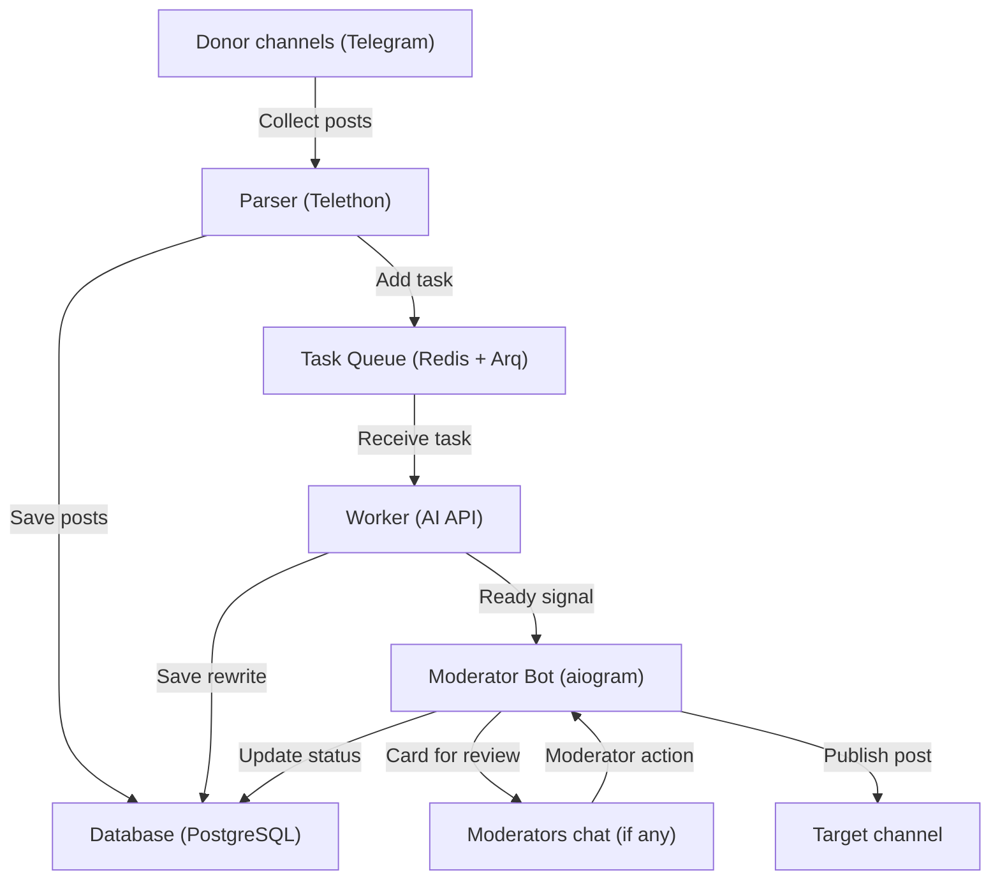

*Русская версия доступна в [README_ru.md](README_ru.md)*

# Telegram Channel Admin (AI Moderator)

[](https://www.python.org)
[](https://www.docker.com)
[](https://github.com/aiogram/aiogram)
[](https://www.postgresql.org)
[](https://redis.io)
[](https://openai.com)

A bot assistant for Telegram channel administrators. It automatically collects new posts from selected donor channels, removes ads and spam, rewrites the text using neural networks for uniqueness, and sends the ready version to the moderation chat. To publish a post to your channel, you just need to click a single button.

---

## Why is this needed

Managing a channel and constantly coming up with unique content is difficult and time-consuming. Copying other people's posts one-to-one is not an option, as it ruins your reach and reputation. This bot takes the routine upon itself: it finds interesting news from competitors, does a high-quality rewrite via an AI, and allows you to conveniently review the result before publishing.

---

## How the system works

I have divided the project into independent parts so that heavy tasks (collecting posts, requests to AI) do not slow down the bot and the database.


```mermaid
flowchart TD
    Donors["Donor channels (Telegram)"] -->|Collect posts| Parser["Parser (Telethon)"]
    Parser -->|Save posts| DB["Database (PostgreSQL)"]
    Parser -->|Add task| Queue["Task Queue (Redis + Arq)"]
    Queue -->|Receive task| Worker["Worker (AI API)"]
    Worker -->|Save rewrite| DB
    Worker -->|Ready signal| Bot["Moderator Bot (aiogram)"]
    Bot -->|Card for review| ModGroup["Moderators chat (if any)"]
    ModGroup -->|Moderator action| Bot
    Bot -->|Update status| DB
    Bot -->|Publish post| TargetChannel["Target channel"]
```

### What the project consists of

1. **Parser (Telethon)**: works as a regular Telegram user (Userbot). It monitors selected channels and saves new posts to PostgreSQL. Duplicates are immediately discarded at the database level using `INSERT ... ON CONFLICT DO NOTHING`.
2. **Task Queue (Redis + Arq)**: transfers tasks between services. Arq works fast and gets along perfectly with asynchronous code.
3. **Worker (Arq + AsyncOpenAI)**: checks text for ads based on a stop-word list. If everything is clean, it sends the text to the neural network. Automatic processing of API limits (Exponential Backoff) is configured here, and during long network requests, the connection to the database is closed so as not to waste resources.
4. **Bot (aiogram)**: sends posts to moderators in the form of cards with buttons. You can publish, reject, or edit (`/edit`) a post directly from Telegram. The bot is protected against the situation where two moderators simultaneously click the same button.

---

## How to start the project

The entire setup via Docker Compose will take about 10 minutes.

### Step 1. Get API keys

1. **Telegram API (for the parser)**:
   - Go to [my.telegram.org](https://my.telegram.org) and log in with your phone number.
   - Go to **API development tools**.
   - Create a new application (the name and short name can be anything).
   - Copy the `API_ID` (number) and `API_HASH` (string).
2. **Telegram bot token (for moderation)**:
   - Write to [@BotFather](https://t.me/BotFather) on Telegram.
   - Create a bot with the `/newbot` command and copy its token (`TELEGRAM_BOT_TOKEN`).
3. **AI API key**:
   - Any provider with an OpenAI-compatible API (OpenAI itself, DeepSeek, OpenRouter, Mistral, a local model, or a proxy) will work. Create an API key in your account with the chosen provider.

### Step 2. Configure the environment

1. Copy the settings template to the working file:
   ```bash
   cp .env.example .env
   ```
2. Open the `.env` file and enter your data. The parameters in `DATABASE_URL` must match `POSTGRES_USER`, `POSTGRES_PASSWORD`, and `POSTGRES_DB`.

| Variable | What it is | Example |
| :--- | :--- | :--- |
| `POSTGRES_DB` | PostgreSQL database name | `tg_admin` |
| `POSTGRES_USER` | PostgreSQL user | `postgres` |
| `POSTGRES_PASSWORD` | PostgreSQL password | `secure_password` |
| `DATABASE_URL` | Link to connect to the database | `postgresql+asyncpg://postgres:secure_password@db:5432/tg_admin` |
| `REDIS_URL` | Link to connect to Redis | `redis://redis:6379/0` |
| `TELEGRAM_BOT_TOKEN` | Your bot's token | `123456:ABC-DEF...` |
| `ADMIN_IDS` | Comma-separated admin IDs (who has access) | `123456789,987654321` |
| `TARGET_CHANNEL_ID` | ID of the channel where the ready posts will go | `-1001234567890` |
| `MODERATOR_CHAT_ID` | Moderator group ID. If left empty, posts will go to the first admin's DMs | `-1001987654321` |
| `API_ID` | API ID from my.telegram.org | `1234567` |
| `API_HASH` | API Hash from my.telegram.org | `abcdef0123456789abcdef0123456789` |
| `CHANNELS_TO_TRACK` | Links or IDs of donor channels separated by commas | `channel1, @channel2, -1001111111` |
| `AI_API_KEY` | AI provider API key | `sk-proj-...` or your API key |
| `AI_BASE_URL` | API Base URL (leave empty for OpenAI or specify the URL of your provider/proxy) | `https://api.deepseek.com/v1` |
| `AI_MODEL` | Which model to use for the rewrite | `gpt-4o-mini` or `deepseek-chat` |
| `AD_KEYWORDS` | Stop words for ad filtering (comma-separated) | `ad, promo, subscribe` |
| `OPENAI_EXTRA_BODY` | Additional settings for the AI in JSON format | `{"temperature": 0.7}` |
| `LANGUAGE` | Bot interface language (currently only `ru` is supported) | `ru` |

### Step 3. Configure the AI prompt

Before starting, be sure to adjust the prompt to suit the theme of your channel.

> [!WARNING]
> By default, the [prompts.py](src/core/prompts.py) file contains settings for gaming and tech topics (lively conversational style without emojis).
> Edit the `SYSTEM_PROMPT_REWRITE` variable in the [src/core/prompts.py](src/core/prompts.py) file for yourself, otherwise the bot will rewrite all posts in a gamer style.

### Step 4. Authorize the parser in Telegram

The parser works via a Telethon session. You need to log into the account once so the bot can read channels without constantly entering SMS codes.

1. Start the database and Redis:
   ```bash
   docker compose up -d redis db
   ```
2. Run the authorization script:
   ```bash
   docker compose run --rm parser python src/login.py
   ```
3. Enter the account phone number (e.g., `+79991234567`) and the verification code that will be sent to you in Telegram.
4. After this, an `anon.session` file will appear in the `data/` folder. Now the bot can work on its own.

### Step 5. Full launch

Launch the project with a single command. The migrations service will apply changes to the database and shut down, while the rest of the services will continue working in the background.

```bash
docker compose up -d --build
```

#### Useful commands for work:

* View the status of containers:
  ```bash
  docker compose ps
  ```
* View the logs of all services:
  ```bash
  docker compose logs -f
  ```
* View the logs of a specific service (e.g., the worker):
  ```bash
  docker compose logs -f worker
  ```
* Stop the project:
  ```bash
  docker compose down
  ```
* Stop the project and completely reset the database:
  ```bash
  docker compose down -v
  ```

---

## How to manage the bot

You can fully control the collection, intervals, and queues directly via the chat with the bot.

### Main features

* **Spam protection**: In normal (`auto`) mode, the bot shows only one post for moderation. Another 5 can wait in the queue. If the queue is full, the parser temporarily stops collecting new posts.
* **Intervals**: Posts do not arrive all at once. Set a delay, and the bot will pause before sending the next card.
* **Pause**: Post collection can be temporarily suspended.
* **Curation mode**: The bot can simply accumulate posts without rewriting. Upon your command, the AI will select the best news for a specified time, and delete the rest.

### Bot commands

Send these commands in the moderation chat or in DMs to the bot.

#### Modes
* `/mode auto` — enable normal automatic mode.
* `/mode curation` — enable curation mode (collecting posts into an accumulator).

#### Curation and collection
* `/best` — select up to 6 best posts over the last 24 hours. One will immediately go for review, the rest will stand in the queue. Excess posts will be deleted. Resets current intervals.
* `/best 24h` (you can specify time, e.g., `30m` or `2d`) — select the best for the specified period.
* `/parse [time or amount],[number of channels]` — manually start collection.
  * `/parse 24h,5` — collect posts for the last 24 hours from 5 random donor channels.
  * `/parse 10,2` — collect 10 latest posts from 2 random channels.
  * `/parse 5` — collect 5 latest posts from all channels.
* `/mod` (or `/moderation`) — request the oldest post for review.
* **Moderation** button — take a post for review.
* **Clear all** button — clear the queue, the current card, and the accumulator.

#### Intervals
* `/interval 20-50` — random pause from 20 to 50 seconds before the next post.
* `/interval 30` — fixed pause of 30 seconds.
* `/interval 5m` — fixed pause of 5 minutes (you can use letters s, m, h, d).
* `/interval 0` — send posts without delays (as processed by AI).

#### Pause and status
* `/pause` — stop the parser until manually turned back on.
* `/pause 8h` — stop the parser for 8 hours.
* `/resume` — resume post collection.
* `/status` — open the control panel with quick buttons.
* `/help` — show help on commands.
* `/clear` — delete posts under moderation and clear the accumulator.
* `/clear_db` — completely clear the database.
* `/queue [number]` — change the queue limit (default is 5).

#### Additional features
* **Card duplication**: If you configured a moderation chat (`MODERATOR_CHAT_ID`), the bot will still duplicate posts in DMs to the first administrator (`ADMIN_IDS`). You can make decisions from any chat.
* **Who published**: When a moderator presses a button, the bot writes at the bottom of the card: `Action by: @username`. It's immediately clear who made the decision.
* **Reset interval**: The "Reset interval" button in the status panel allows you to instantly send all posts from the queue without waiting.
* **Manual posts**: Send the bot any text or media file directly in the chat with the bot without commands. The bot will perceive this as a manual post, download the files, do a rewrite via AI, and send a ready card for review.

> [!TIP]
> In time commands, you can use letters: `s` (seconds), `m` (minutes), `h` (hours), `d` (days). If you don't write a letter, the bot will count the time in seconds.

---

## Security

* **Settings protection**: The `.env` file and the `data/` folder with sessions are added to `.gitignore` so that you don't accidentally expose them to the public.
* **Access**: The bot responds only to users from the `ADMIN_IDS` list. Unauthorized people will not be able to manage it.
* **Reliability**: Queue tasks are saved in Redis, so nothing will be lost when containers are restarted. The database is protected from deadlocks during long requests to the AI.

---

## License

This project is licensed under the MIT License. For details, see the [LICENSE](LICENSE) file.
