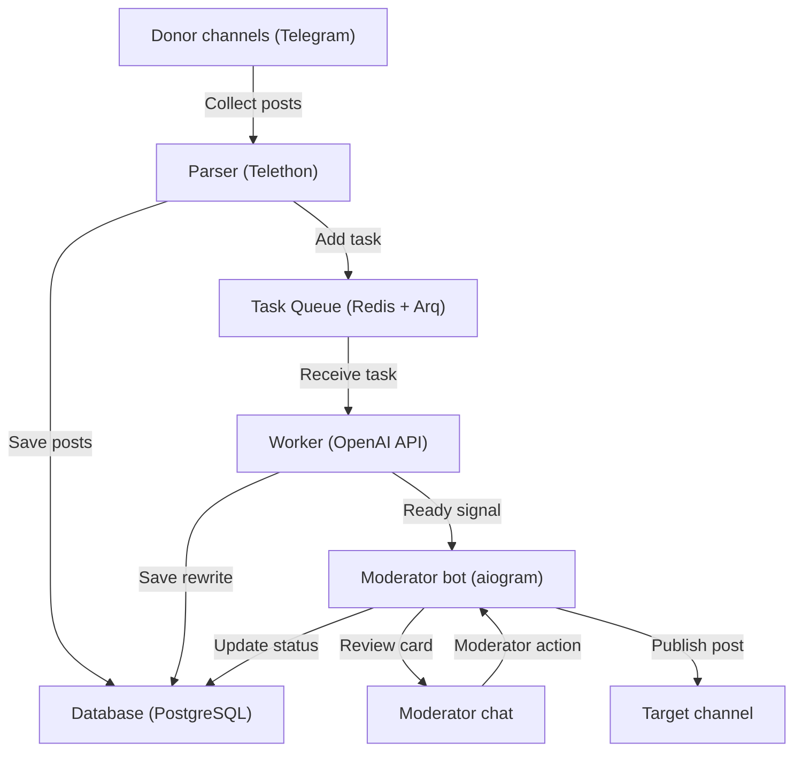

*English version coming soon* (Английская версия скоро выйдет)

# Telegram Channel Admin (AI Moderator)

[](https://www.python.org)
[](https://www.docker.com)
[](https://github.com/aiogram/aiogram)
[](https://www.postgresql.org)
[](https://redis.io)
[](https://openai.com)

An automated pipeline for Telegram channel administrators. The system aggregates posts from donor channels, filters out spam and ads, rewrites the content using Large Language Models (LLM) to ensure uniqueness, and sends the final result to a moderation chat. Publishing to the target channel is done with a single click.

## The Problem Solved

Creating unique content takes a lot of time. Simply copying content harms the channel's reach and reputation. This project automates the routine: it parses original sources, performs high-quality rewriting via a neural network, and provides a convenient moderation interface before publishing.

---

## System Architecture

The project is divided into independent microservices so that heavy tasks (parsing, neural network API requests) do not block the moderation interface and the database.



### Components:
1. **Parser (Telethon)**: Operates as a Telegram client (Userbot), listening to selected channels. It saves new posts to PostgreSQL. It uses atomic `INSERT ... ON CONFLICT DO NOTHING` to instantly filter out duplicates at the DBMS level.
2. **Queue (Redis + Arq)**: Ensures asynchronous task delivery. Arq was chosen for its high speed and seamless integration with `asyncio`.
3. **Worker (Arq + AsyncOpenAI)**: Checks the text against a stop-word dictionary. If there are no ads, it sends a request to the LLM. I implemented a custom Exponential Backoff to handle API limits. During network requests, the DB session is closed, preventing connection pool leaks. Duplicates are cancelled automatically.
4. **Bot (aiogram)**: Sends post cards to moderators. Supports publishing, rejecting, and editing (`/edit`) directly in Telegram. It is protected against simultaneous clicks by different moderators using optimistic locks.

---

## Deployment and Setup

Deploying the system is done via Docker Compose and takes about 10 minutes.

### Step 1. Prepare API Keys

1. **Telegram API (Userbot)**:
   - Go to [my.telegram.org](https://my.telegram.org) and log in with your phone number.
   - Go to the **API development tools** section.
   - Create a new application (fill in any name and short name).
   - Copy the provided `API_ID` (number) and `API_HASH` (string) values. These are required to authorize the parser (Telethon).
2. **Telegram Bot Token (Moderator)**:
   - Open a chat with [@BotFather](https://t.me/BotFather) in Telegram.
   - Send the `/newbot` command, set a name and a unique username for your bot.
   - Copy the issued token (`TELEGRAM_BOT_TOKEN`).
3. **OpenAI API Key**:
   - Go to your personal OpenAI dashboard (or use the address of your API provider/proxy).
   - Create a new API key (`AI_API_KEY`) with access to the `gpt-4o-mini` model (or another of your choice).

### Step 2. Environment Setup

1. Copy the configuration file template to the working `.env` file:
   ```bash
   cp .env.example .env
   ```
2. Open the `.env` file in a text editor and configure the parameters.
   > **Important:** Ensure that the connection parameters in `DATABASE_URL` match the `POSTGRES_USER`, `POSTGRES_PASSWORD`, and `POSTGRES_DB` values.

| Variable | Description | Example Value |
|---|---|---|
| `POSTGRES_DB` | PostgreSQL database name | `tg_admin` |
| `POSTGRES_USER` | PostgreSQL user | `postgres` |
| `POSTGRES_PASSWORD` | PostgreSQL password | `secure_password` |
| `DATABASE_URL` | DB connection string | `postgresql+asyncpg://postgres:secure_password@db:5432/tg_admin` |
| `REDIS_URL` | Redis connection string | `redis://redis:6379/0` |
| `TELEGRAM_BOT_TOKEN` | Moderator bot token | `123456:ABC-DEF...` |
| `ADMIN_IDS` | Moderator account IDs separated by commas | `123456789,987654321` |
| `TARGET_CHANNEL_ID` | Channel ID where approved posts are published | `-1001234567890` |
| `MODERATOR_CHAT_ID` | Group/chat ID where the bot sends review cards | `-1001987654321` |
| `API_ID` | Telegram API ID (from my.telegram.org) | `1234567` |
| `API_HASH` | Telegram API Hash (from my.telegram.org) | `abcdef0123456789abcdef0123456789` |
| `CHANNELS_TO_TRACK` | Usernames or IDs of donor channels to parse (comma-separated) | `channel1, @channel2, -1001111111` |
| `AI_API_KEY` | OpenAI API access key | `sk-proj-...` |
| `AI_BASE_URL` | Base API URL (leave empty for OpenAI or specify proxy) | `https://api.openai.com/v1` |
| `AI_MODEL` | AI model used for rewriting | `gpt-4o-mini` |
| `AD_KEYWORDS` | Stop-words for ad filtering (case-insensitive, comma-separated) | `ads, promo, subscribe` |
| `OPENAI_EXTRA_BODY` | Optional JSON parameters to fine-tune API requests | `{"temperature": 0.7}` |

### Step 3. Authorize the Parser Session

The parser uses a Telegram client session (Telethon), which must be authorized once before launching the main application:

1. Start the DBMS and Redis in the background:
   ```bash
   docker compose up -d redis db
   ```
2. Run the interactive login script:
   ```bash
   docker compose run --rm parser python src/login.py
   ```
3. The script will ask you to enter your phone number (in international format, e.g., `+79991234567`) and the confirmation code sent to your Telegram app.
4. Upon successful login, the authorized session file `anon.session` will be created in the mounted `data/` folder. This file allows the bot to operate without constantly requiring SMS/codes.

### Step 4. Full Project Launch

Now you can start all services. The `migrator` container will automatically apply Alembic database migrations and then exit, while the rest of the services will remain running in the background.

```bash
docker compose up -d --build
```

#### Useful Commands:
* **Check container status**:
  ```bash
  docker compose ps
  ```
* **View logs in real-time**:
  ```bash
  docker compose logs -f
  ```
* **Logs of a specific service** (e.g., worker):
  ```bash
  docker compose logs -f worker
  ```
* **Stop the application**:
  ```bash
  docker compose down
  ```
* **Stop and remove saved data (hard reset)**:
  ```bash
  docker compose down -v
  ```

---

## Security and Reliability

- **Data Security**: The `.env` and `data/anon.session` files contain sensitive data and are protected from entering the public repository via `.gitignore`. Never share them with third parties.
- **Access Restriction**: The bot verifies the sender's ID against the `ADMIN_IDS` list. Requests from unauthorized users are ignored.
- **Fault Tolerance**: The architecture guarantees data preservation when containers restart. Arq queue tasks are saved in Redis, and DBMS transactions are protected against deadlocks.
