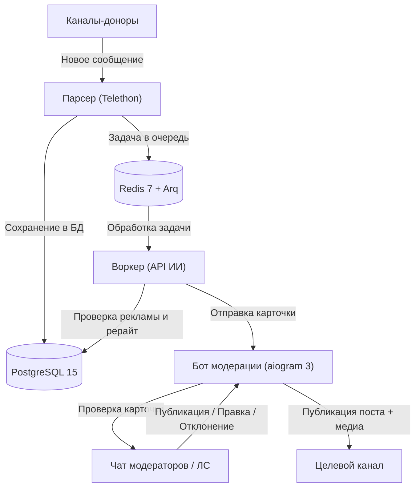

*English version is available in [README.md](README.md) | Канал автора: [t.me/ivanchik_byte](https://t.me/ivanchik_byte)*

# Telegram Channel Admin (ИИ-Модератор и Куратор Контента)

[](https://www.python.org)
[](https://www.docker.com)
[](https://github.com/aiogram/aiogram)
[](https://github.com/LonamiWebs/Telethon)
[](https://www.postgresql.org)
[](https://redis.io)
[](https://t.me/ivanchik_byte)
[](https://t.me/ivanchikbyte)
[](LICENSE)

Асинхронный микросервисный контент-пайплайн и Telegram-бот для администраторов каналов. Система автоматически отслеживает каналы-доноры, фильтрует рекламу, генерирует уникальный рерайт через нейросеть (OpenAI, DeepSeek или любой совместимый API) и присылает карточки модерации для публикации, отклонения или правки в один клик.

---

## Возможности

- **Автоматический мониторинг каналов**: Перехват постов и медиафайлов из каналов-доноров через Telethon (MTProto Userbot).
- **Фильтрация рекламы и спама**: Автоматическое удаление рекламы, промокодов, ссылок на розыгрыши и стоп-слов до отправки в нейросеть.
- **ИИ-рерайтер**: Превращает сырые новости в готовые посты с нативным форматированием под Telegram через OpenAI-совместимый API.
- **Умная дедупликация**: Хэширование нормализованного текста предотвращает дублирование одинаковых новостей из разных источников.
- **Интерактивные карточки модерации**: Кнопки в Telegram для публикации, отклонения, ручной правки, замены медиа и доработки текста через промпт.
- **Интервалы и анти-спам**: Случайные или фиксированные паузы между постами для предотвращения завала канала.
- **Ручной прием постов**: Отправка любого текста или медиа напрямую боту в ЛС для моментального рерайта.
- **Режим кураторства**: Накопление постов в буфер и отбор ТОП-6 лучших новостей за 24 часа по одной команде (`/best`).
- **Двухъязычная система**: Раздельный выбор языка интерфейса (`ru`/`en`) и языка генерации постов (`ru`/`en`).

---

## Архитектура



---

## Установка и запуск

### Предварительные требования

- **Docker** и **Docker Compose v2**
- **Номер телефона Telegram** (для работы Userbot через Telethon)
- **Токен бота Telegram** от [@BotFather](https://t.me/BotFather)
- **API ID и API Hash** с сайта [my.telegram.org](https://my.telegram.org)
- **API-ключ нейросети** (OpenAI, DeepSeek, OpenRouter и др.)

---

### Шаг 1: Клонирование репозитория

```bash
git clone https://github.com/ivanchik-byte/Telegram-Channel-Admin.git
cd Telegram-Channel-Admin
```

---

### Шаг 2: Настройка переменных окружения

Создайте файл конфигурации `.env`:

```bash
cp .env.example .env
```

Откройте `.env` и укажите ваши данные:

```ini
# База данных PostgreSQL
POSTGRES_USER=postgres
POSTGRES_PASSWORD=your_secure_password
POSTGRES_DB=tg_admin
DATABASE_URL=postgresql+asyncpg://postgres:your_secure_password@db:5432/tg_admin

# Redis
REDIS_URL=redis://redis:6379/0

# Telegram MTProto API (с my.telegram.org)
API_ID=12345678
API_HASH=abcdef0123456789abcdef0123456789

# Каналы-доноры (ID или юзернеймы через запятую)
CHANNELS_TO_TRACK=-1001234567890,@channel_username,donor_channel

# Настройки бота Telegram
TELEGRAM_BOT_TOKEN=123456789:ABCdefGHIjklMNOpqrSTUvwxYZ
TARGET_CHANNEL_ID=-1001234567890
MODERATOR_CHAT_ID=-1001987654321
ADMIN_IDS=123456789

# Настройки нейросети
AI_API_KEY=sk-proj-your-key-here
AI_BASE_URL=https://api.openai.com/v1
AI_MODEL=gpt-4o-mini
AD_KEYWORDS=реклама,erid,промокод,подписывайтесь,скидка,розыгрыш,promo
OPENAI_EXTRA_BODY={"temperature": 0.7}

# Язык интерфейса по умолчанию (ru / en)
LANGUAGE=ru
```

> **Где взять Telegram ID:**
> - Узнать свой ID: [@userinfobot](https://t.me/userinfobot).
> - Добавьте созданного бота администратором в **Группу модераторов** и в **Целевой канал**.
> - ID каналов и групп должны начинаться с `-100...`.

---

### Шаг 3: Авторизация парсера (Разовый вход)

Telethon должен создать файл сессии (`data/anon.session`) для чтения каналов:

1. Запустите базу данных и Redis:
   ```bash
   docker compose up -d db redis
   ```

2. Запустите скрипт авторизации:
   ```bash
   docker compose run --rm parser python src/login.py
   ```

3. Введите номер телефона, код подтверждения из Telegram и пароль 2FA (если включен).

---

### Шаг 4: Сборка и запуск всех сервисов

Запустите проект в фоновом режиме:

```bash
docker compose up -d --build
```

Проверьте, что все 5 контейнеров работают:

```bash
docker compose ps
```

---

### Шаг 5: Первый запуск и настройка бота

1. Откройте Telegram и напишите команду `/start` вашему боту.
2. Выберите **Язык интерфейса** и **Язык генерации постов** на инлайн-кнопках.
3. Панель управления и кнопки модерации готовы к работе.

---

## Справочник команд бота

| Команда | Аргументы | Режим | Описание | Пример |
| :--- | :--- | :--- | :--- | :--- |
| `/start` | Нет | Любой | Перезапуск сессии и выбор языков | `/start` |
| `/status` | Нет | Любой | Отображение статуса, размера очереди и быстрых кнопок | `/status` |
| `/mode` | `<auto \| curation>` | Любой | Переключение между потоковым (`auto`) и накопительным (`curation`) режимом | `/mode auto` |
| `/interval` | `<время \| диапазон \| 0>` | Любой | Настройка паузы между постами. `0` — без задержки | `/interval 20-50`, `/interval 5m`, `/interval 0` |
| `/pause` | `[время]` | Любой | Приостановка сбора постов бессрочно или на указанное время | `/pause 8h`, `/pause` |
| `/resume` | Нет | Любой | Возобновление сбора постов | `/resume` |
| `/queue` | `[лимит]` | Auto | Изменение лимита очереди постов (по умолчанию: 5) | `/queue 10` |
| `/best` | `[период]` | Curation | Выбор ТОП-6 лучших постов за период с помощью ИИ | `/best 24h`, `/best` |
| `/parse` | `[время\|кол-во],[каналы]` | Любой | Принудительный сбор старых постов из каналов | `/parse 24h,5`, `/parse 10,2` |
| `/mod` | Нет | Любой | Запрос старейшего поста из очереди на немедленную проверку | `/mod` |
| `/edit` | `<id> <текст>` | Любой | Быстрое редактирование текста поста по его ID | `/edit 15 Новый текст поста` |
| `/lang` | Нет | Любой | Настройка языка интерфейса и языка генерации | `/lang` |
| `/clear` | Нет | Любой | Сброс постов в очереди и на модерации | `/clear` |
| `/clear_db` | Нет | Любой | Полное удаление всех постов из базы данных | `/clear_db` |
| `/help` | Нет | Любой | Отображение справки по командам | `/help` |

---

## Работа с карточкой модерации

Когда пост обработан нейросетью, бот присылает карточку в чат модерации:

- **Опубликовать**: Отправляет пост с HTML-форматированием и медиафайлом в целевой канал, удаляет временный файл и запускает интервал.
- **Отклонить**: Отклоняет пост и удаляет медиафайл.
- **Редактировать текст**: Включает режим правки — отправьте новый текст следующим сообщением или командой `/edit <id> <текст>`.
- **Заменить медиа**: Загрузка нового фото/видео или удаление вложения.
- **ИИ-правка**: Отправьте инструкцию текстом (например: *"сократи вдвое"*, *"добавь иронии"*), и ИИ перепишет пост заново.
- **Ссылки на источник**: Внешние ссылки и ссылка на оригинал приходят отдельным сообщением под карточкой.

---

## Команды управления через терминал

```bash
# Просмотр логов всех сервисов в реальном времени
docker compose logs -f

# Просмотр логов конкретного сервиса
docker compose logs -f bot
docker compose logs -f worker
docker compose logs -f parser

# Перезапуск всех сервисов с пересборкой
docker compose down
docker compose up -d --build

# Применение миграций БД
docker compose run --rm migrator alembic upgrade head

# Полная очистка БД и сброс очереди (ВНИМАНИЕ: удаляет данные постов)
docker compose down -v
```

---

## Контакты и автор

- Telegram-канал: [t.me/ivanchik_byte](https://t.me/ivanchik_byte)
- Личные сообщения: [t.me/ivanchikbyte](https://t.me/ivanchikbyte)

---

## Лицензия

Проект распространяется под свободной лицензией **MIT License**. Подробности см. в файле [LICENSE](LICENSE).
