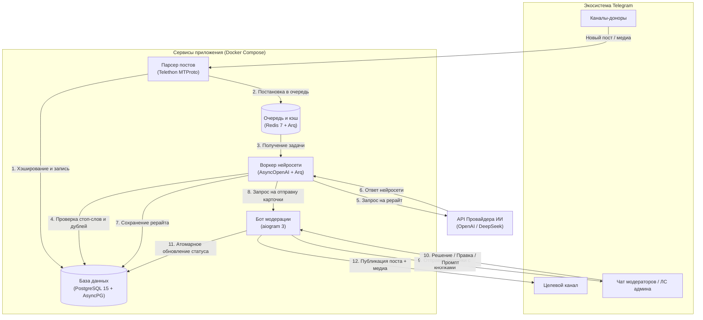
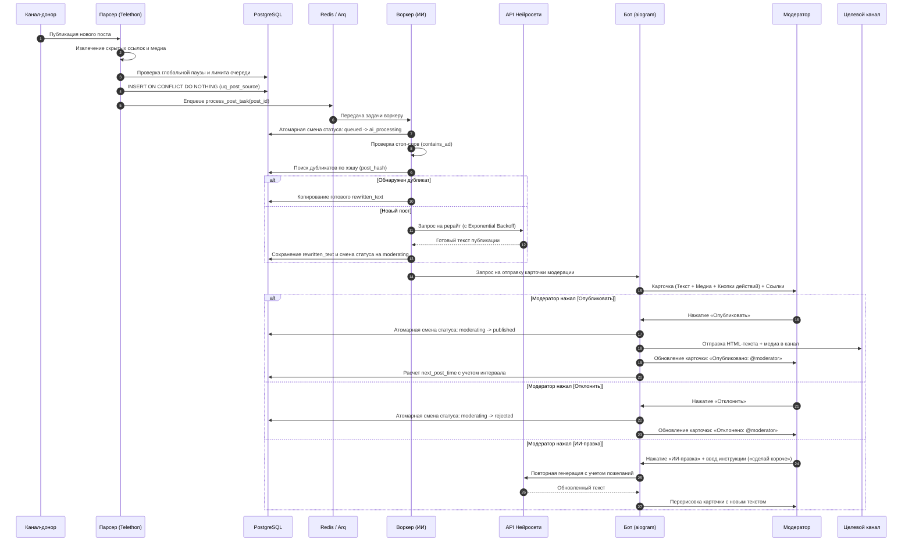

*English version is available in [README.md](README.md)*

# Telegram Channel Admin (ИИ-Модератор и Куратор Контента)

[](https://www.python.org)
[](https://www.docker.com)
[](https://github.com/aiogram/aiogram)
[](https://github.com/LonamiWebs/Telethon)
[](https://www.postgresql.org)
[](https://redis.io)
[](https://github.com/samuelcolvin/arq)
[](https://platform.openai.com)
[](LICENSE)

Асинхронный микросервисный контент-пайплайн и бот-модератор на базе нейросетей для администраторов Telegram-каналов. Система в реальном времени собирает посты из выбранных каналов-доноров, отсекает рекламу и спам, выполняет глубокий качественный рерайт с помощью LLM, загружает медиафайлы и присылает структурированные карточки модерации для публикации в один клик, ручной правки или интерактивной доработки через промпты нейросети.

---

## Содержание

- [Обзор и ключевые возможности](#обзор-и-ключевые-возможности)
- [Стек технологий](#стек-технологий)
- [Архитектура и устройство системы](#архитектура-и-устройство-системы)
  - [Схема микросервисов](#схема-микросервисов)
  - [Жизненный цикл обработки поста (Sequence-диаграмма)](#жизненный-цикл-обработки-поста-sequence-диаграмма)
  - [Структура директорий проекта](#структура-директорий-проекта)
  - [Схема базы данных и конечный автомат статусов](#схема-базы-данных-и-конечный-автомат-статусов)
- [Предварительные требования](#предварительные-требования)
- [Пошаговая установка и запуск](#пошаговая-установка-и-запуск)
  - [Шаг 1: Клонирование репозитория](#шаг-1-клонирование-репозитория)
  - [Шаг 2: Получение ключей Telegram API и токена бота](#шаг-2-получение-ключей-telegram-api-и-токена-бота)
  - [Шаг 3: Настройка файла конфигурации (.env)](#шаг-3-настройка-файла-конфигурации-env)
  - [Шаг 4: Настройка системного промпта нейросети](#шаг-4-настройка-системного-промпта-нейросети)
  - [Шаг 5: Авторизация сессии парсера (Telethon)](#шаг-5-авторизация-сессии-парсера-telethon)
  - [Шаг 6: Запуск всех сервисов через Docker Compose](#шаг-6-запуск-всех-сервисов-через-docker-compose)
  - [Шаг 7: Мастер начальной настройки языков (/start)](#шаг-7-мастер-начальной-настройки-языков-start)
- [Управление ботом и руководство пользователя](#управление-ботом-и-руководство-пользователя)
  - [Режимы работы: Автоматический vs Кураторский](#режимы-работы-автоматический-vs-кураторский)
  - [Полный справочник команд бота](#полный-справочник-команд-бота)
  - [Интерактивные карточки модерации](#интерактивные-карточки-модерации)
  - [Панель управления статусом и быстрые кнопки](#панель-управления-статусом-и-быстрые-кнопки)
  - [Умные интервалы и защита от перегрузки очереди](#умные-интервалы-и-защита-от-перегрузки-очереди)
  - [Режим кураторства и отбор лучших постов (/best)](#режим-кураторства-и-отбор-лучших-постов-best)
  - [Ручная отправка постов администратором](#ручная-отправка-постов-администратором)
  - [Двухъязычная система (Интерфейс vs Язык постов)](#двухъязычная-система-интерфейс-vs-язык-постов)
- [Справочник переменных окружения (.env)](#справочник-переменных-окружения-env)
- [Управление через терминал и Docker](#управление-через-терминал-и-docker)
- [Развертывание в продакшене и эксплуатация](#развертывание-в-продакшене-и-эксплуатация)
- [Безопасность и надежность](#безопасность-и-надежность)
- [Устранение неполадок и FAQ](#устранение-неполадок-и-faq)
- [Лицензия](#лицензия)

---

## Обзор и ключевые возможности

Ведение авторского Telegram-канала с непрерывным потоком уникального контента отнимает огромное количество времени. Прямое копирование чужих публикаций уничтожает охваты и доверие читателей, а написание новостей с нуля требует постоянного ручного мониторинга десятков источников.

**Telegram Channel Admin** полностью автоматизирует рутину создания контента:
- **Автоматический сбор постов**: Отслеживает любые публичные и закрытые каналы через клиентский протокол Telethon (MTProto Userbot).
- **Многоуровневая фильтрация рекламы**: Автоматически отсекает рекламные интеграции, спам-фразы, промокоды, ссылки на розыгрыши и реферальные хвосты до обращения к нейросети.
- **Интеллектуальный ИИ-рерайтер**: Поддерживает любые OpenAI-совместимые API (OpenAI GPT-4o, DeepSeek, OpenRouter, Mistral, Ollama, Groq) для создания живых постов с нативным форматированием под Telegram.
- **Асинхронная очередь задач**: Архитектура на базе Redis и Arq с автоматическим повтором запросов (Exponential Backoff) при лимитах API (HTTP 429 / 5xx) и сетевых сбоях.
- **Умная дедупликация контента**: Хэширование нормализованного текста (MD5) предотвращает дублирование одинаковых новостей из разных каналов. При обнаружении дубля переиспользуется готовый текст рерайта без лишних затрат токенов.
- **Интерактивные карточки модерации**: Подача постов в Telegram с кнопками: **Опубликовать**, **Отклонить**, **Редактировать текст вручную**, **Заменить медиа** или **Доработать через ИИ** (например: *"сделай короче"*, *"добавь иронии"*).
- **Умные интервалы и защита от спама**: Настраиваемые случайные или фиксированные паузы (например, `20-50s`, `5m`) между отправкой карточек, защищающие чат модераторов от завала.
- **Ручной прием постов**: Отправьте боту в личные сообщения любой текст, фото, видео или документ — он моментально перепишет его через нейросеть и сформирует карточку.
- **Режим кураторства**: Накопление сырых постов без мгновенных вызовов ИИ с последующим выбором ТОП-6 самых виральных и интересных новостей за 24 часа по одной команде.
- **Двухъязычная локализация**: Независимое переключение языка интерфейса бота (`ru` / `en`) и языка генерации постов нейросетью (`ru` / `en`).

---

## Стек технологий

| Компонент | Технология | Назначение |
| :--- | :--- | :--- |
| **Язык разработки** | Python 3.11 | Современная асинхронная среда выполнения со строгой типизацией |
| **Бот модерации** | [aiogram 3.10](https://github.com/aiogram/aiogram) | Асинхронный фреймворк Telegram Bot API с машиной состояний (FSM) и роутерами |
| **Парсер каналов** | [Telethon 1.35](https://github.com/LonamiWebs/Telethon) | MTProto-клиент для мониторинга каналов-доноров и скачивания медиафайлов |
| **База данных** | PostgreSQL 15 | Реляционное хранилище постов, настроек, хэшей дедупликации и статусов |
| **ORM и миграции** | SQLAlchemy 2.0 (Async) + Alembic | Асинхронная работа с БД через драйвер `asyncpg` и версионируемые миграции |
| **Очередь задач** | [Arq 0.26](https://github.com/samuelcolvin/arq) + Redis 7 | Высокопроизводительная очередь задач и планировщик фоновых фоновых крон-задач |
| **Интеграция с ИИ** | AsyncOpenAI + httpx | Клиент для работы с OpenAI, DeepSeek, OpenRouter и локальными LLM |
| **Конфигурация** | Pydantic v2 & Pydantic-Settings | Строгая валидация настроек и загрузка переменных из `.env` |
| **Контейнеризация** | Docker & Docker Compose | Изолированная оркестрация кластера из 5 микросервисов |

---

## Архитектура и устройство системы

Проект спроектирован в виде изолированных микросервисов. Длительные сетевые операции (парсинг Telegram-каналов, запросы к API нейросетей) отделены от бота модерации и базы данных, что полностью исключает зависания и дедлоки.

### Схема микросервисов



### Жизненный цикл обработки поста (Sequence-диаграмма)



### Структура директорий проекта

```
TG_Channel_Bot/
├── alembic/                       # Скрипты миграций базы данных Alembic
│   ├── env.py                     # Окружение асинхронного запуска миграций
│   └── versions/                  # Версионированные файлы миграций
├── data/                          # Постоянное хранилище (монтируется в Docker)
│   ├── anon.session               # Файл пользовательской сессии Telethon
│   └── media/                     # Скачанные фото, видео и документы
├── src/                           # Исходный код приложения
│   ├── bot/                       # Бот модерации Telegram (aiogram 3)
│   │   ├── handlers.py            # Обработчики команд, FSM-состояний и кнопок
│   │   └── main.py                # Инициализация и запуск поллинга бота
│   ├── core/                      # Базовые общие компоненты
│   │   ├── config.py              # Pydantic Settings и валидация .env
│   │   ├── constants.py           # Лимиты Telegram и константы приложения
│   │   ├── i18n.py                # Словарь переводов интерфейса (RU/EN)
│   │   ├── logger.py              # Настройки централизованного логирования
│   │   ├── prompts.py             # Системные промпты для рерайта (RU/EN)
│   │   └── utils.py               # Санитизация HTML и парсеры времени
│   ├── database/                  # Слой взаимодействия с базой данных
│   │   ├── engine.py              # Асинхронный движок SQLAlchemy и сессии
│   │   ├── models.py              # Модели ORM (ProcessedPost, BotSettings)
│   │   └── repository.py          # Репозитории атомарных запросов к БД
│   ├── parser/                    # Сервис мониторинга каналов (Telethon)
│   │   ├── handlers.py            # Перехват сообщений и дедупликация
│   │   ├── join_channels.py       # Утилита для автоподписки на каналы
│   │   └── main.py                # Главный цикл клиента и слушатель force_parse
│   ├── worker/                    # Сервис фоновых задач (Arq)
│   │   ├── main.py                # Настройки WorkerSettings и хуки старта/стопа
│   │   └── tasks.py               # Задачи рерайта, кураторства и очистки
│   └── login.py                   # Скрипт интерактивной авторизации в Telegram
├── .dockerignore                  # Исключения сборки Docker
├── .env.example                   # Шаблон файла конфигурации
├── .gitignore                     # Исключения системы контроля версий Git
├── alembic.ini                    # Конфигурация Alembic
├── clean.py                       # Скрипт быстрой очистки таблицы постов
├── COMMANDS.md                    # Английская шпаргалка по командам Docker
├── COMMANDS_ru.md                 # Русская шпаргалка по командам Docker
├── Dockerfile                     # Описание сборки контейнеров
├── docker-compose.yml             # Оркестрация кластера из 5 сервисов
├── LICENSE                        # Лицензия MIT
├── README.md                      # Документация на английском языке
├── README_ru.md                   # Документация на русском языке (этот файл)
└── requirements.txt               # Зафиксированные версии Python-пакетов
```

### Схема базы данных и конечный автомат статусов

#### Таблица `processed_posts`
| Поле | Тип данных | Ограничения | Назначение |
| :--- | :--- | :--- | :--- |
| `id` | `INTEGER` | Primary Key, Auto-increment | Уникальный номер поста |
| `source_channel_id`| `BIGINT` | Индексировано | ID канала-источника в Telegram |
| `source_message_id`| `BIGINT` | `uq_post_source` | ID сообщения в канале-источнике |
| `post_hash` | `VARCHAR(64)` | Индексировано | MD5-хэш нормализованного текста для дедупликации |
| `status` | `VARCHAR(50)` | `chk_status` | Текущий статус обработки поста |
| `text` | `TEXT` | Not Null | Исходный текст из канала-донора |
| `rewritten_text` | `TEXT` | Nullable | Готовый текст рерайта от нейросети |
| `media_path` | `VARCHAR(512)`| Nullable | Путь к сохраненному медиафайлу в `data/media/` |
| `media_type` | `VARCHAR(50)` | Nullable | Тип медиафайла: `photo`, `video`, `document` |
| `source_link` | `VARCHAR(255)`| Nullable | Прямая ссылка на оригинальный пост в Telegram |
| `created_at` | `TIMESTAMPTZ` | Default `now()` | Время добавления записи |

#### Таблица `bot_settings`
| Поле | Тип данных | По умолчанию | Назначение |
| :--- | :--- | :--- | :--- |
| `id` | `INTEGER` | Primary Key | ID записи настроек (синглтон) |
| `mode` | `VARCHAR(50)` | `'auto'` | Режим работы: `'auto'` или `'curation'` |
| `interval_min` | `INTEGER` | `0` | Минимальная пауза между постами (в секундах) |
| `interval_max` | `INTEGER` | `0` | Максимальная пауза между постами (в секундах) |
| `pause_until` | `TIMESTAMPTZ` | `NULL` | Время, до которого приостановлен прием постов |
| `next_post_time` | `TIMESTAMPTZ` | `NULL` | Запланированное время выдачи следующей карточки |
| `queue_limit` | `INTEGER` | `5` | Лимит постов в очереди ожидания модерации |
| `ui_lang` | `VARCHAR(10)` | `'ru'` | Язык интерфейса бота (`'ru'` / `'en'`) |
| `post_lang` | `VARCHAR(10)` | `'ru'` | Язык генерации публикаций (`'ru'` / `'en'`) |

#### Переходы состояний поста (State Machine)
```
[seen] --> [queued] --> [ai_processing] --> [moderating] --> [published]
  |           |               |                   |
  |--> [filtered_ad]          |--> [failed]       |--> [rejected]
  |--> [accumulated] (curation)
```

---

## Предварительные требования

Перед началом убедитесь, что на вашем сервере или локальном компьютере установлены:

- **Docker Engine** (версия 24.0+) и **Docker Compose v2** (версия 2.20+)
- **Git** для клонирования репозитория
- **Аккаунт Telegram** (номер телефона) для авторизации парсера через Telethon
- **Токен бота Telegram**, созданный через [@BotFather](https://t.me/BotFather)
- **API-ключ провайдера нейросети** (OpenAI, DeepSeek, OpenRouter или локальная LLM)

---

## Пошаговая установка и запуск

### Шаг 1: Клонирование репозитория

```bash
git clone https://github.com/ivanchik-byte/Telegram-Channel-Admin.git
cd Telegram-Channel-Admin
```

### Шаг 2: Получение ключей Telegram API и токена бота

1. **Ключи Telegram API (для парсера Telethon)**:
   - Авторизуйтесь под своим номером телефона на сайте [my.telegram.org](https://my.telegram.org).
   - Перейдите в раздел **API development tools**.
   - Создайте новое приложение (название и короткое имя могут быть любыми).
   - Скопируйте числовой `App api_id` и строковый `App api_hash`.

2. **Токен Telegram-бота модерации**:
   - Напишите [@BotFather](https://t.me/BotFather) в Telegram.
   - Отправьте команду `/newbot`, укажите имя и юзернейм бота.
   - Скопируйте выданный токен (например, `123456789:ABCdef...`).

3. **Определение необходимых ID в Telegram**:
   - **Ваш Admin User ID**: Напишите боту [@userinfobot](https://t.me/userinfobot), чтобы узнать свой числовой ID.
   - **ID чата модераторов**: Добавьте вашего бота в группу модераторов, сделайте его администратором и отправьте любое сообщение. Скопируйте отрицательный ID (например, `-1001987654321`).
   - **ID целевого канала**: Добавьте бота в ваш публичный или закрытый канал администратором с правом *Публикация сообщений*. Скопируйте отрицательный ID канала (например, `-1001234567890`).

### Шаг 3: Настройка файла конфигурации (.env)

Скопируйте шаблон конфигурации в рабочий файл `.env`:
```bash
cp .env.example .env
```

Откройте `.env` в текстовом редакторе (`nano .env` или `vim .env`) и заполните параметры:

```ini
# Подключение к базе данных PostgreSQL
POSTGRES_USER=postgres
POSTGRES_PASSWORD=your_secure_password
POSTGRES_DB=tg_admin
DATABASE_URL=postgresql+asyncpg://postgres:your_secure_password@db:5432/tg_admin

# Подключение к Redis (кэш и очередь Arq)
REDIS_URL=redis://redis:6379/0

# Данные авторизации Telethon MTProto
API_ID=12345678
API_HASH=abcdef0123456789abcdef0123456789

# Каналы-доноры для отслеживания (через запятую: ID или юзернеймы)
CHANNELS_TO_TRACK=-1001234567890,tech_news_channel,@gaming_insider

# Настройки провайдера нейросети (ИИ)
AI_API_KEY=sk-proj-your-ai-api-key-here
AI_BASE_URL=https://api.openai.com/v1          # Либо https://api.deepseek.com/v1
AI_MODEL=gpt-4o-mini                           # Либо deepseek-chat, gpt-4o и др.
AD_KEYWORDS=реклама,erid,промокод,подписывайтесь,скидка,розыгрыш,подпишись,promo
OPENAI_EXTRA_BODY={"temperature": 0.7}

# Настройки бота модерации Telegram
TELEGRAM_BOT_TOKEN=123456789:ABCdefGHIjklMNOpqrSTUvwxYZ
MODERATOR_CHAT_ID=-1001987654321               # Если пусто, карточки пойдут в ЛС первому админу
TARGET_CHANNEL_ID=-1001234567890               # Канал, куда публикуются готовые посты
ADMIN_IDS=123456789,987654321                  # ID администраторов с доступом к боту

# Язык интерфейса по умолчанию (ru / en)
LANGUAGE=ru
```

### Шаг 4: Настройка системного промпта нейросети

Перед первым запуском проверьте системный промпт под специфику вашего канала:

- Промпты находятся в файле [`src/core/prompts.py`](src/core/prompts.py) (`SYSTEM_PROMPT_REWRITE_RU` и `SYSTEM_PROMPT_REWRITE_EN`).
- По умолчанию промпт настроен на технологическую и геймерскую тематику: живой разговорный стиль, акцентированное выделение ключевых слов жирным шрифтом, структурированные списки и умеренное использование эмодзи.
- Если ваш канал посвящен финансам, праву, крипте или новостям компаний — скорректируйте правила подачи текста в `prompts.py`.

### Шаг 5: Авторизация сессии парсера (Telethon)

Для сбора сообщений Telethon должен один раз сохранить авторизационную сессию (`data/anon.session`):

1. Запустите контейнеры базы данных и Redis:
   ```bash
   docker compose up -d db redis
   ```

2. Запустите интерактивный скрипт входа:
   ```bash
   docker compose run --rm parser python src/login.py
   ```

3. Введите номер телефона (в международном формате, например `+79991234567`) и код подтверждения из Telegram. Если включена двухфакторная аутентификация (2FA), введите пароль.
4. После успешного входа сессия сохранится в файле `data/anon.session`.

### Шаг 6: Запуск всех сервисов через Docker Compose

Соберите и запустите все 5 микросервисов в фоновом режиме:

```bash
docker compose up -d --build
```

Проверьте статус контейнеров:
```bash
docker compose ps
```

*Пример корректного вывода:*
```
NAME                           IMAGE                        COMMAND                  SERVICE      STATUS
tg_channel_bot-db-1            postgres:15-alpine           "docker-entrypoint.s…"   db           Up (healthy)
tg_channel_bot-redis-1         redis:7-alpine               "docker-entrypoint.s…"   redis        Up (healthy)
tg_channel_bot-migrator-1      tg_channel_bot-migrator      "alembic upgrade head"   migrator     Exited (0)
tg_channel_bot-parser-1        tg_channel_bot-parser        "python -m src.parse…"   parser       Up
tg_channel_bot-worker-1        tg_channel_bot-worker        "arq src.worker.main…"   worker       Up
tg_channel_bot-bot-1           tg_channel_bot-bot           "python -m src.bot.m…"   bot          Up
```

### Шаг 7: Мастер начальной настройки языков (/start)

1. Откройте Telegram и отправьте боту команду `/start`.
2. Бот проверит ваш ID по списку `ADMIN_IDS` и предложит интерактивный мастер:
   - **Шаг 1**: Выбор языка интерфейса бота (Русский или English).
   - **Шаг 2**: Выбор языка генерации постов нейросетью (Русский или English).
3. После завершения откроется главное меню с кнопками управления.

---

## Управление ботом и руководство пользователя

### Режимы работы: Автоматический vs Кураторский

Бот поддерживает два режима работы:

| Режим | Команда | Принцип работы | Для каких каналов подходит |
| :--- | :--- | :--- | :--- |
| **Auto** *(По умолчанию)* | `/mode auto` | Новые посты сразу проверяются на рекламу, переписываются нейросетью и по очереди приходят на модерацию с заданными интервалами. | Новостные каналы с оперативной повесткой, непрерывный поток публикаций. |
| **Curation** | `/mode curation` | Посты сохраняются в базу в сыром виде (`accumulated`) без траты токенов ИИ. По команде админа ИИ выбирает лучшие посты за период. | Дайджесты, авторские каналы с отбором только ключевых новостей дня. |

---

### Полный справочник команд бота

Команды доступны только администраторам, указанным в `ADMIN_IDS`:

| Команда | Аргументы | Режим | Описание | Пример |
| :--- | :--- | :--- | :--- | :--- |
| `/start` | Нет | Любой | Перезапуск сессии, приветствие и запуск мастера настройки языков | `/start` |
| `/status` | Нет | Любой | Открывает статусную панель с количеством постов, интервалами и быстрыми кнопками | `/status` |
| `/mode` | `<auto \| curation>` | Любой | Переключение режима: потоковый (`auto`) или накопительный (`curation`) | `/mode auto` |
| `/interval` | `<время \| диапазон \| 0>`| Любой | Установка паузы между выдачей карточек. `0` — выключить паузы | `/interval 20-50`, `/interval 5m`, `/interval 0` |
| `/pause` | `[время]` | Любой | Приостановка сбора постов бессрочно или на указанный период | `/pause`, `/pause 8h`, `/pause 45m` |
| `/resume` | Нет | Любой | Немедленное возобновление сбора постов | `/resume` |
| `/queue` | `[число]` | Auto | Просмотр или изменение максимального лимита очереди постов (по умолчанию: 5) | `/queue 10` |
| `/best` | `[период]` | Curation | Выбор ИИ до 6 лучших виральных постов из накопителя за последние N часов | `/best`, `/best 24h`, `/best 3d` |
| `/parse` | `[время\|кол-во],[каналы]`| Любой | Принудительный сбор архивных постов из каналов-доноров | `/parse 24h,5`, `/parse 10,2`, `/parse 5` |
| `/mod` | Нет | Любой | Запрос старейшего поста из очереди на немедленную проверку | `/mod` |
| `/edit` | `<id> <новый_текст>` | Любой | Быстрое ручное изменение текста поста по его номеру | `/edit 42 Новый текст для поста` |
| `/lang` | Нет | Любой | Меню раздельного выбора языка интерфейса и языка постов | `/lang` |
| `/clear` | Нет | Любой | Сброс всех постов на модерации и в очереди ожидания | `/clear` |
| `/clear_db`| Нет | Любой | Полная очистка базы данных от всех сохраненных постов | `/clear_db` |
| `/help` | Нет | Любой | Отображение подробной справки по командам | `/help` |

> [!TIP]
> В аргументах времени можно использовать суффиксы: `s` (секунды), `m` (минуты), `h` (часы), `d` (дни). Например: `/interval 1m-3m`, `/pause 12h`.

---

### Интерактивные карточки модерации

После рерайта нейросетью пост поступает модераторам в виде карточки:

```
┌────────────────────────────────────────────────────────┐
│ Анонсирована новая архитектура видеокарт               │
│                                                        │
│ NVIDIA официально представила микроархитектуру        │
│ Blackwell: прирост производительности в ИИ-задачах до  │
│ 4 раз при значительном снижении энергопотребления.     │
│                                                        │
│ Первые поставки ожидаются уже в этом квартале.         │
└────────────────────────────────────────────────────────┘
[ Опубликовать ]          [ Отклонить ]
[ Редактировать текст ]    [ Заменить медиа ]
[ ИИ-правка (Промпт) ]
```

#### Возможности кнопок карточки:

1. **Опубликовать**:
   - Публикует пост с HTML-форматированием и прикрепленным медиафайлом (фото, видео, документ) в `TARGET_CHANNEL_ID`.
   - Удаляет временный файл с диска (`data/media/`).
   - Изменяет текст сообщения модератора на: `Опубликовано | Действие от: @username`.
   - Запускает таймер случайного интервала перед отправкой следующей карточки.

2. **Отклонить**:
   - Переводит пост в статус `rejected`.
   - Очищает временные медиафайлы.
   - Изменяет карточку на: `Отклонено | Действие от: @username`.

3. **Редактировать текст**:
   - Включает режим FSM: модератор просто отправляет новый текст следующим сообщением в чат, и карточка моментально обновляется.
   - Либо можно использовать команду `/edit <id> <текст>`.

4. **Заменить медиа**:
   - Позволяет прикрепить новое фото, видео или документ, либо полностью удалить медиавложение.

5. **ИИ-правка (Интерактивный промпт)**:
   - Бот запрашивает пожелание к тексту на человеческом языке (например: *"сократи в 2 раза"*, *"добавь сарказма в вывод"*, *"сделай упор на цену"*).
   - Нейросеть генерирует новый вариант и карточка обновляется прямо в чате.

6. **Блок ссылок и источника**:
   - Все внешние ссылки, обнаруженные в оригинальном посте, а также прямая ссылка на оригинал (`https://t.me/c/...`) отправляются отдельным сообщением сразу под карточкой для быстрой проверки фактов.

---

### Панель управления статусом и быстрые кнопки

Команда `/status` выводит актуальные показатели и интерактивное меню:

```
Статус системы:
- Режим: AUTO
- Язык UI: RU
- Язык постов: RU
- Интервал: 30 сек - 1 мин 30 сек
- Сбор постов: Активен
- Следующий пост через: 45 сек

На модерации: 1
В очереди: 3 / 5
В накопителе: 18
```

Кнопки быстрого управления:
- **Обновить статус**
- **Взять на модерацию**
- **Спарсить 5 постов сейчас**
- **Выбрать лучшие посты**
- **Пауза на 8 часов** / **Возобновить**
- **Очистить очередь** / **Сбросить БД**
- **Настройки языка**

---

### Умные интервалы и защита от перегрузки очереди

Для предотвращения спама в канале и чате модерации:
- **Лимит очереди (`/queue 5`)**: Если 1 пост уже ждет проверки и 5 находятся в очереди, парсер временно перестает перехватывать новые сообщения, защищая диск и память сервера.
- **Случайные интервалы (`/interval 30-90`)**: После публикации или отклонения бот выдерживает случайную паузу от 30 до 90 секунд перед отправкой следующей новости.
- **Мгновенный пропуск**: Кнопка «Взять на модерацию» позволяет взять следующий пост сразу, не дожидаясь окончания интервала.

---

### Режим кураторства и отбор лучших постов (/best)

В **Кураторском режиме** (`/mode curation`) посты просто сохраняются в базу данных без обращения к нейросети.

При вызове команды `/best 24h`:
1. Система собирает все посты из накопителя за последние 24 часа.
2. Нейросеть оценивает их по виральности, пользе и важности, ранжируя список.
3. Самый сильный пост моментально переписывается и присылается на модерацию.
4. Следующие 5 лучших постов выстраиваются в очередь.
5. Остальные слабые посты переводятся в статус `filtered_ad`, сохраняя базу в чистоте.

---

### Ручная отправка постов администратором

Администратор может отправить любой черновик напрямую боту в личные сообщения:
1. Отправьте текст, фото с подписью, видео или документ в диалог с ботом.
2. Бот сохранит медиафайл, сгенерирует хэш и поставит задачу в очередь Arq.
3. Воркер перепишет текст в авторском стиле вашего канала.
4. Готовая карточка модерации придет вам на согласование.

---

### Двухъязычная система (Интерфейс vs Язык постов)

В системе разделены настройки языков:
- **Язык интерфейса (`ui_lang`)**: Тексты всех кнопок, служебных сообщений, уведомлений и меню (`ru` или `en`).
- **Язык постов (`post_lang`)**: Язык, на котором нейросеть пишет итоговые публикации. Если задан `ru`, посты из англоязычных каналов будут автоматически переведены и переписаны на качественном русском языке.

Настройка доступна в любой момент через `/lang` или `/settings`.

---

## Справочник переменных окружения (.env)

| Переменная | Тип | По умолчанию | Обязательно | Описание | Пример |
| :--- | :--- | :--- | :--- | :--- | :--- |
| `POSTGRES_USER` | `строка` | `postgres` | Да | Пользователь PostgreSQL | `postgres` |
| `POSTGRES_PASSWORD` | `строка` | `postgres` | Да | Пароль базы данных PostgreSQL | `SuperSecretPass123` |
| `POSTGRES_DB` | `строка` | `tg_admin` | Да | Название базы данных PostgreSQL | `tg_admin` |
| `DATABASE_URL` | `строка` | — | Да | Строка подключения SQLAlchemy Async | `postgresql+asyncpg://postgres:pass@db:5432/tg_admin` |
| `REDIS_URL` | `строка` | — | Да | Строка подключения к Redis для Arq | `redis://redis:6379/0` |
| `API_ID` | `число` | — | Да | Telegram App API ID с my.telegram.org | `1234567` |
| `API_HASH` | `строка` | — | Да | Telegram App API Hash с my.telegram.org | `0123456789abcdef0123456789abcdef` |
| `CHANNELS_TO_TRACK` | `строка` | — | Да | Список каналов-доноров (ID или юзернеймы) | `-1001234567890,@tech_news,gaming` |
| `TELEGRAM_BOT_TOKEN`| `строка` | — | Да | Токен Telegram-бота от @BotFather | `123456789:ABCdefGHIjklMNOpqr...` |
| `TARGET_CHANNEL_ID` | `строка` | — | Да | ID канала, куда публикуются готовые посты | `-1001234567890` |
| `MODERATOR_CHAT_ID` | `строка` | `""` | Нет | ID чата модераторов (если пусто — в ЛС первому админу) | `-1001987654321` |
| `ADMIN_IDS` | `строка` | `[]` | Да | Список Telegram ID администраторов через запятую | `123456789,987654321` |
| `AI_API_KEY` | `строка` | — | Да | API-ключ провайдера нейросети | `sk-proj-abc123...` |
| `AI_BASE_URL` | `строка` | `https://api.openai.com/v1` | Нет | URL API (для DeepSeek, OpenRouter, прокси) | `https://api.deepseek.com/v1` |
| `AI_MODEL` | `строка` | `gpt-4o-mini`| Нет | Модель для рерайта и кураторства | `gpt-4o-mini`, `deepseek-chat` |
| `AD_KEYWORDS` | `строка` | *(список)* | Нет | Стоп-слова для фильтрации рекламы | `реклама,промокод,скидка,розыгрыш,erid` |
| `OPENAI_EXTRA_BODY` | `JSON` | `{}` | Нет | Дополнительные параметры для запроса к LLM | `{"temperature": 0.7}` |
| `LANGUAGE` | `строка` | `ru` | Нет | Начальный язык интерфейса бота (`ru` / `en`) | `ru` |

---

## Управление через терминал и Docker

### Управление жизненным циклом сервисов

Все команды выполняются из корневой папки проекта:

```bash
# Запуск всех микросервисов в фоновом режиме
docker compose up -d

# Полная пересборка и перезапуск (после изменения кода)
docker compose up -d --build

# Просмотр объединенных логов всех сервисов в реальном времени
docker compose logs -f

# Просмотр логов конкретного сервиса
docker compose logs -f bot       # Бот модерации aiogram
docker compose logs -f worker    # Воркер рерайта Arq
docker compose logs -f parser    # Парсер каналов Telethon
docker compose logs -f db        # СУБД PostgreSQL

# Проверка статуса и состояния контейнеров
docker compose ps

# Безопасная остановка системы (БД и очередь сохраняются)
docker compose down

# Полный сброс (ВНИМАНИЕ: удаляет данные PostgreSQL и кэш Redis)
docker compose down -v
```

### Обслуживание базы данных и миграции

```bash
# Применение всех миграций базы данных
docker compose run --rm migrator alembic upgrade head

# Создание новой миграции после изменения models.py
docker compose run --rm migrator alembic revision --autogenerate -m "Add column"

# Быстрая очистка таблицы постов отдельным скриптом
docker compose run --rm bot python clean.py
```

---

## Развертывание в продакшене и эксплуатация

### 1. Рекомендуемые параметры VPS
- **Процессор**: 2 vCPU
- **Оперативная память**: от 2 ГБ (рекомендуется 4 ГБ при активной обработке видео)
- **Диск**: от 20 ГБ SSD (для хранения временных медиафайлов в `data/media`)
- **ОС**: Ubuntu 22.04 LTS / Debian 12

### 2. Автоматическая очистка устаревших данных
- Воркер Arq запускает ежедневную задачу по крону в `03:00 UTC`, которая удаляет из базы данных записи постов старше 48 часов, предотвращая разрастание дискового пространства.
- Временные медиафайлы удаляются сразу же после публикации или отклонения поста модератором.

### 3. Резервное копирование базы данных
Настройте ежедневный бэкап PostgreSQL через системный `cron` хоста:
```bash
# Создание сжатого дампа базы данных
docker compose exec -T db pg_dump -U postgres tg_admin | gzip > /backups/tg_admin_$(date +\%F).sql.gz

# Восстановление базы данных из дампа
gunzip < /backups/tg_admin_2026-08-17.sql.gz | docker compose exec -T db psql -U postgres -d tg_admin
```

### 4. Безопасность Telegram Userbot
- Используйте для парсера прогретый аккаунт с историей (не регистрируйте свежий номер перед запуском).
- Не отслеживайте сотни каналов одновременно с одной сессии во избежание ограничений FloodWait.
- Никогда не передавайте и не загружайте в открытый доступ файл `data/anon.session`.

---

## Безопасность и надежность

- **Строгая фильтрация прав**: Все сообщения, кнопки и команды проходят через фильтр `IsModeratorFilter`. Посторонние пользователи получают отказ в доступе.
- **Изоляция секретов**: Файлы `.env`, каталоги БД и папка `data/` с сессиями добавлены в `.gitignore`.
- **Защита пула соединений БД**: На время длительных запросов к нейросети (5–15 секунд) воркер освобождает соединение с PostgreSQL, предотвращая исчерпание пула.
- **Защита от SQL-инъекций**: Все запросы построены на параметризованных выражениях асинхронного SQLAlchemy 2.0.
- **Санитизация HTML**: Весь пользовательский текст экранируется через `format_telegram_html` перед вставкой в разметку Telegram.

---

## Устранение неполадок и FAQ

### 1. Парсер выдает ошибку `SessionPasswordNeededError`
- **Причина**: На Telegram-аккаунте включена двухфакторная аутентификация (2FA / облачный пароль).
- **Решение**: Запустите `docker compose run --rm parser python src/login.py` и введите пароль 2FA в терминале.

### 2. Ошибка бота: `ChatNotFound` или `MigratedToSupergroup`
- **Причина**: Обычная группа Telegram была преобразована в супергруппу, и ее ID изменился с `-123456789` на `-100123456789`.
- **Решение**: Обновите параметр `MODERATOR_CHAT_ID` в файле `.env` на новый ID и перезапустите бота: `docker compose up -d`.

### 3. Воркер возвращает ошибку HTTP 429 (Rate Limit Exceeded)
- **Причина**: Превышены лимиты запросов в минуту (RPM) или токенов (TPM) у провайдера нейросети.
- **Решение**: Воркер автоматически повторяет попытку с экспоненциальной задержкой (`2s`, `4s`, `8s`, `16s`, `32s`). Если ошибка повторяется, перейдите на более высокий тариф API или используйте альтернативный `AI_BASE_URL`.

### 4. Ошибка скачивания тяжелых медиафайлов
- **Причина**: Стандартные ограничения Telegram Bot API на размер файлов (20 МБ).
- **Решение**: Парсер автоматически обрабатывает медиа стандартных размеров. Если файл скачать не удалось, пост публикуется в текстовом виде с сохранением ссылки на источник.

### 5. Ошибка подключения сервисов к базе данных
- **Причина**: Сервис базы данных `db` еще не прошел проверку здоровья (Healthcheck).
- **Решение**: Убедитесь, что в `docker-compose.yml` задано условие `condition: service_healthy`. Проверьте логи СУБД: `docker compose logs db`.

---

## Лицензия

Проект распространяется под свободной лицензией **MIT License**. Подробности см. в файле [LICENSE](LICENSE).
