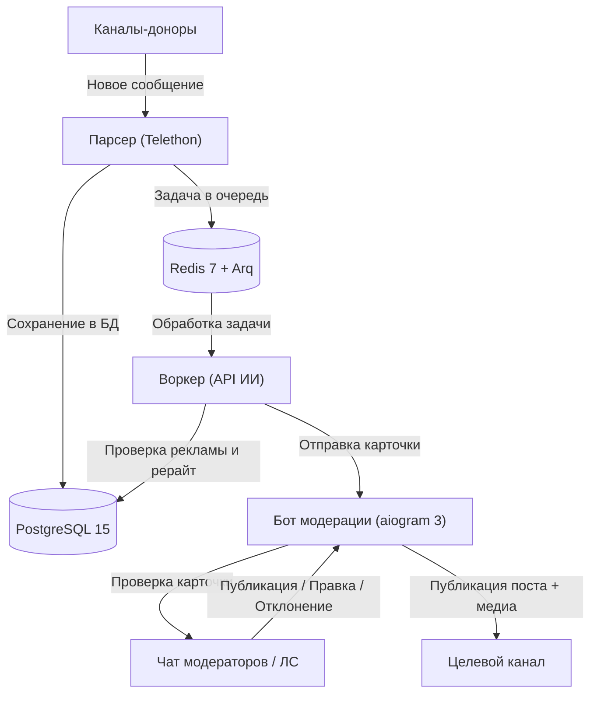

🇬🇧 🇺🇸 ENGLISH VERSION IS AVAILABLE HERE: [README_en.md](README_en.md) | Канал автора: [t.me/ivanchik_byte](https://t.me/ivanchik_byte)

> 🤖 **Инструкция для ИИ-агентов / Быстрый старт**: Если вы используете ИИ-агента (Claude Code, Cursor, Windsurf, Antigravity и др.) для скачивания и запуска проекта, передайте ему документ **[INSTALL.md](INSTALL.md)**.

# Telegram Channel Admin (ИИ-Модератор и Куратор Контента)

[](https://github.com/ivanchik-byte/Telegram-Channel-Admin)
[](https://www.python.org)
[](https://www.docker.com)
[](https://github.com/aiogram/aiogram)
[](https://github.com/LonamiWebs/Telethon)
[](https://www.postgresql.org)
[](https://redis.io)
[](https://t.me/ivanchik_byte)
[](https://t.me/ivanchikbyte)
[](LICENSE)

Асинхронный микросервисный контент-пайплайн и Telegram-бот для администраторов каналов. Система автоматически отслеживает каналы-доноры, фильтрует рекламу, генерирует уникальный рерайт через нейросеть (OpenAI, DeepSeek или любой совместимый API) и присылает карточки модерации для публикации, отклонения или правки в один клик.

---

## Возможности

- **Автоматический мониторинг каналов**: Перехват постов и медиафайлов из каналов-доноров через Telethon (MTProto Userbot).
- **Фильтрация рекламы и спама**: Автоматическое удаление рекламы, промокодов, ссылок на розыгрыши и стоп-слов до отправки в нейросеть.
- **ИИ-рерайтер**: Превращает сырые новости в готовые посты с нативным форматированием под Telegram через OpenAI-совместимый API.
- **Умная дедупликация**: Хэширование нормализованного текста предотвращает дублирование одинаковых новостей из разных источников.
- **Интерактивные карточки модерации**: Кнопки в Telegram для публикации, отклонения, ручной правки, замены медиа и доработки текста через промпт.
- **Интервалы и анти-спам**: Случайные или фиксированные паузы между постами для предотвращения завала канала.
- **Ручной прием постов**: Отправка любого текста или медиа напрямую боту в ЛС для моментального рерайта.
- **Режим кураторства**: Накопление постов в буфер и отбор ТОП-6 лучших новостей за 24 часа по одной команде (`/best`).
- **Двухъязычная система**: Раздельный выбор языка интерфейса (`ru`/`en`) и языка генерации постов (`ru`/`en`).

---

## Архитектура



---

## Установка и запуск

> 🤖 **Инструкция для ИИ-агентов**: Для автоматического развертывания проекта с помощью ИИ-агента используйте специализированный файл **[INSTALL.md](INSTALL.md)**.

### Предварительные требования

- **Docker** и **Docker Compose v2** (Docker Desktop для Windows/macOS или Docker Engine для Linux)
- **Номер телефона Telegram** (для работы Userbot через Telethon)
- **Токен бота Telegram** от [@BotFather](https://t.me/BotFather)
- **API ID и API Hash** с сайта [my.telegram.org](https://my.telegram.org)
- **API-ключ нейросети** (OpenAI, DeepSeek, OpenRouter и др.)

---

### Установка на Linux / macOS

#### 1. Клонирование репозитория

```bash
git clone https://github.com/ivanchik-byte/Telegram-Channel-Admin.git
cd Telegram-Channel-Admin
```

#### 2. Настройка переменных окружения

```bash
cp .env.example .env
```

Заполните файл `.env` своими данными (см. описание ниже).

#### 3. Авторизация парсера (Разовый вход)

```bash
docker compose up -d db redis
docker compose run --rm parser python src/login.py
```

Введите номер телефона, код подтверждения из Telegram и 2FA-пароль (если есть).

#### 4. Сборка и запуск сервисов

```bash
docker compose up -d --build
docker compose logs -f
```

---

### Установка на Windows (Docker Desktop)

1. Установите и запустите [Docker Desktop для Windows](https://www.docker.com/products/docker-desktop/) (убедитесь, что в настройках включен бэкенд **WSL 2**).
2. Откройте **PowerShell** или командную строку (**CMD**) и клонируйте проект:
   ```powershell
   git clone https://github.com/ivanchik-byte/Telegram-Channel-Admin.git
   cd Telegram-Channel-Admin
   copy .env.example .env
   ```
3. Откройте `.env` в Блокноте или VS Code и укажите ваши ключи и ID.
4. Выполните разовую авторизацию в Telegram:
   ```powershell
   docker compose up -d db redis
   docker compose run --rm parser python src/login.py
   ```
   Введите телефон, проверочный код и облачный пароль 2FA.
5. Запустите весь проект:
   ```powershell
   docker compose up -d --build
   docker compose logs -f
   ```

---

### Настройка переменных окружения (`.env`)

```ini
# --- База данных PostgreSQL ---
POSTGRES_USER=postgres                                                     # Пользователь БД для контейнера PostgreSQL
POSTGRES_PASSWORD=your_secure_password                                     # Пароль для базы данных
POSTGRES_DB=tg_admin                                                       # Имя базы данных для хранения постов и настроек
DATABASE_URL=postgresql+asyncpg://postgres:your_secure_password@db:5432/tg_admin # Асинхронная строка подключения (asyncpg)

# --- Кэш и очередь задач Redis ---
REDIS_URL=redis://redis:6379/0                                             # Ссылка на Redis для очереди задач Arq

# --- Telegram MTProto API (с сайта https://my.telegram.org) ---
API_ID=12345678                                                            # Числовой App API ID
API_HASH=abcdef0123456789abcdef0123456789                                  # Строковый App API Hash
CHANNELS_TO_TRACK=-1001234567890,@channel_username,donor_channel            # Каналы-доноры через запятую (ID или юзернеймы)

# --- Настройки бота Telegram ---
TELEGRAM_BOT_TOKEN=123456789:ABCdefGHIjklMNOpqrSTUvwxYZ                     # Токен бота от @BotFather
TARGET_CHANNEL_ID=-1001234567890                                           # ID целевого канала для публикации постов
MODERATOR_CHAT_ID=-1001987654321                                           # ID группы модераторов (или пусто для отправки в ЛС)
ADMIN_IDS=123456789,987654321                                              # Telegram ID администраторов с доступом (узнать в @userinfobot)

# --- Настройки провайдера нейросети (ИИ) ---
AI_API_KEY=sk-proj-your-key-here                                           # API-ключ (OpenAI, DeepSeek, OpenRouter и др.)
AI_BASE_URL=https://api.openai.com/v1                                      # Базовый URL API провайдера
AI_MODEL=gpt-4o-mini                                                       # Модель нейросети для рерайта и отбора
AD_KEYWORDS=реклама,erid,промокод,подписывайтесь,скидка,розыгрыш,promo     # Стоп-слова для фильтрации рекламы через запятую
OPENAI_EXTRA_BODY={"temperature": 0.7}                                     # Дополнительные параметры в формате JSON

# --- Язык интерфейса по умолчанию ---
LANGUAGE=ru                                                                # Язык интерфейса бота (ru / en)
```

> **Где взять Telegram ID:**
> - Узнать свой ID: [@userinfobot](https://t.me/userinfobot).
> - Добавьте созданного бота администратором в **Группу модераторов** и в **Целевой канал**.
> - ID каналов и групп должны начинаться с `-100...`.

---

### Первый запуск и настройка бота

1. Откройте Telegram и напишите команду `/start` вашему боту.
2. Выберите **Язык интерфейса** и **Язык генерации постов** на инлайн-кнопках.
3. Панель управления и кнопки модерации готовы к работе.

---

## Справочник команд бота

| Команда | Аргументы | Режим | Описание | Пример |
| :--- | :--- | :--- | :--- | :--- |
| `/start` | Нет | Любой | Перезапуск сессии и выбор языков | `/start` |
| `/status` | Нет | Любой | Отображение статуса, размера очереди и быстрых кнопок | `/status` |
| `/mode` | `<auto \| curation>` | Любой | Переключение между потоковым (`auto`) и накопительным (`curation`) режимом | `/mode auto` |
| `/interval` | `<время \| диапазон \| 0>` | Любой | Настройка паузы между постами. `0` — без задержки | `/interval 20-50`, `/interval 5m`, `/interval 0` |
| `/pause` | `[время]` | Любой | Приостановка сбора постов бессрочно или на указанное время | `/pause 8h`, `/pause` |
| `/resume` | Нет | Любой | Возобновление сбора постов | `/resume` |
| `/queue` | `[лимит]` | Auto | Изменение лимита очереди постов (по умолчанию: 5) | `/queue 10` |
| `/best` | `[период]` | Curation | Выбор ТОП-6 лучших постов за период с помощью ИИ | `/best 24h`, `/best` |
| `/parse` | `[время\|кол-во],[каналы]` | Любой | Принудительный сбор старых постов из каналов | `/parse 24h,5`, `/parse 10,2` |
| `/mod` | Нет | Любой | Запрос старейшего поста из очереди на немедленную проверку | `/mod` |
| `/edit` | `<id> <текст>` | Любой | Быстрое редактирование текста поста по его ID | `/edit 15 Новый текст поста` |
| `/lang` | Нет | Любой | Настройка языка интерфейса и языка генерации | `/lang` |
| `/prompt` | Нет | Любой | Управление системным промптом ИИ (просмотр, интерактивная смена, сброс) | `/prompt` |
| `/set_prompt` | `[текст]` | Любой | Установка своего системного промпта для рерайта | `/set_prompt Пиши в стиле техно-блогера` |
| `/reset_prompt` | Нет | Любой | Сброс промпта на стандартный по умолчанию | `/reset_prompt` |
| `/clear` | Нет | Любой | Сброс постов в очереди и на модерации | `/clear` |
| `/clear_db` | Нет | Любой | Полное удаление всех постов из базы данных | `/clear_db` |
| `/help` | Нет | Любой | Отображение справки по командам | `/help` |

---

## Настройка системного промпта ИИ

В проекте по умолчанию установлен авторский системный промпт, оптимизированный под Telegram-канал про технологии и нейросети ([t.me/ivanchik_byte](https://t.me/ivanchik_byte)) со структурой: *Заголовок -> Контекст события -> Пошаговый пайплайн -> Личный вердикт автора*.

Если ваш канал посвящен другой тематике (криптовалюты, игры, финансы, маркетинг, новости), **обязательно измените системный промпт под формат и тон вашего канала**:

### Способ 1: Через Telegram-бота (на лету без перезапуска)
- Отправьте команду `/prompt` для интерактивного меню управления промптом.
- Или отправьте команду `/set_prompt <текст вашего промпта>`.
- Сбросить промпт к исходному состоянию можно командой `/reset_prompt`.

### Способ 2: В исходном коде
- Откройте файл `src/core/prompts.py`.
- Отредактируйте переменные `SYSTEM_PROMPT_REWRITE_RU` (для русского языка) и `SYSTEM_PROMPT_REWRITE_EN` (для английского языка).
- Перезапустите воркер: `docker compose restart worker`.

---

## Работа с карточкой модерации

Когда пост обработан нейросетью, бот присылает карточку в чат модерации:

- **Опубликовать**: Отправляет пост с HTML-форматированием и медиафайлом в целевой канал, удаляет временный файл и запускает интервал.
- **Отклонить**: Отклоняет пост и удаляет медиафайл.
- **Редактировать текст**: Включает режим правки — отправьте новый текст следующим сообщением или командой `/edit <id> <текст>`.
- **Заменить медиа**: Загрузка нового фото/видео или удаление вложения.
- **ИИ-правка**: Отправьте инструкцию текстом (например: *"сократи вдвое"*, *"добавь иронии"*), и ИИ перепишет пост заново.
- **Ссылки на источник**: Внешние ссылки и ссылка на оригинал приходят отдельным сообщением под карточкой.

---

## Команды управления через терминал

```bash
# Просмотр логов всех сервисов в реальном времени
docker compose logs -f

# Просмотр логов конкретного сервиса
docker compose logs -f bot
docker compose logs -f worker
docker compose logs -f parser

# Перезапуск всех сервисов с пересборкой
docker compose down
docker compose up -d --build

# Применение миграций БД
docker compose run --rm migrator alembic upgrade head

# Полная очистка БД и сброс очереди (ВНИМАНИЕ: удаляет данные постов)
docker compose down -v
```

---

## Контакты и автор

- Telegram-канал: [t.me/ivanchik_byte](https://t.me/ivanchik_byte)
- Личные сообщения: [t.me/ivanchikbyte](https://t.me/ivanchikbyte)

---

## Лицензия

Проект распространяется под свободной лицензией **MIT License**. Подробности см. в файле [LICENSE](LICENSE).
